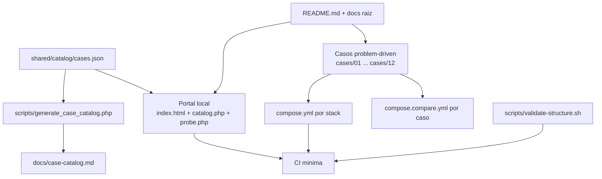

# 🏗️ ARCHITECTURE

> Arquitectura actual del sistema y del repositorio, con foco en la version que hoy vive en `main`.

## 🎯 Resumen ejecutivo

El laboratorio se organiza hoy como un sistema de cuatro capas:

1. una capa editorial y operativa en la raiz;
2. un portal local ligero para evaluacion guiada, mas entradas completas por lenguaje (PHP y Python operativos, cada uno con su propio compose raiz);
3. un catalogo maestro en metadatos compartidos;
4. casos problem-driven con stacks aislados por Docker.

La fuente de verdad ya no esta repartida entre varios archivos manuales: [`shared/catalog/cases.json`](shared/catalog/cases.json) concentra narrativa de producto, documentos, audiencias, stacks y casos operativos.

## 🧭 Topologia actual

## 🧱 Capas del sistema

### 1. Capa editorial y operativa

- `README.md`, `RECRUITER.md`, `INSTALL.md`, `RUNBOOK.md`, `SECURITY.md`, `SUPPORT.md`, `CONTRIBUTING.md`, `CHANGELOG.md`
- `ARCHITECTURE.md` como vista ejecutiva del sistema actual
- `ROADMAP.md` y `docs/` como mapa de crecimiento y detalle

### 2. Catalogo maestro

`shared/catalog/cases.json` ya concentra:

- identidad del producto;
- `About` y `Topics` recomendados para GitHub;
- documentos y rutas por audiencia;
- metadatos de lenguaje;
- catalogo de casos, impacto de negocio y evidencia esperada;
- runtime entries para los stacks operativos.

Esto elimina la duplicacion manual que antes existia entre el portal, la documentacion y los links operativos.

### 3. Portal local y stacks por lenguaje

Cada lenguaje operativo tiene su compose raiz — un comando levanta los 12 casos de ese lenguaje:

- `compose.root.yml` — PHP: portal + 12 casos + PostgreSQL (01–02) + Prometheus + Grafana (puertos 811–8112)
- `compose.python.yml` — Python: 12 casos, stdlib pura, sin dependencias externas (puertos 831–8312)
- `compose.portal.yml` — portal liviano solamente

Los stacks pueden correr en paralelo sin colisión de puertos. Cada lenguaje futuro (Node.js, Java, .NET) seguirá el mismo patron: `compose.{lang}.yml` en la raiz con su bloque de puertos propio.

El portal:
- `portal/app/index.html` presenta la interfaz principal
- `portal/app/catalog.php` transforma el catalogo compartido en payload para la UI
- `portal/app/probe.php` verifica health checks reales y devuelve status code, latencia y timestamp
- `portal/app/index.php` mantiene compatibilidad por redireccion

### 4. Casos, Stacks e Interfaces de Usuario

Cada carpeta en `cases/` representa un problema real. La unidad principal del repositorio no es el lenguaje, sino el problema.

Cada caso contiene carpetas `php`, `node`, `python`, `java` y `dotnet`, con Docker aislado. La paridad funcional depende del estado real del caso.

**Interfaz Visual Inyectada (Native UI):**
Los 12 casos operativos en PHP poseen un mecanismo de detección de clientes (`Accept: text/html`). Si el endpoint se accede desde un navegador, **se inyecta una UI nativa construida en Vanilla JS/CSS (`ui.php`)** que actúa de dashboard visual, sin requerir pesados frameworks de Node.js o infraestructura extra.

**Alta Fidelidad Técnica (Fail-by-Design):**
El laboratorio ha evolucionado de simulaciones matemáticas a **escenarios de fallo operativo reales**. El motor PHP ahora implementa bloqueos físicos de disco (`flock`), saturación de CPU por serialización recursiva, desbordamiento de buffers de memoria y jerarquías de excepciones nativas (`Throwable`). Esto permite que el repositorio no solo cuente una historia, sino que actúe como una prueba de estrés real sobre el runtime corporativo de PHP.

## 📦 Casos operativos actuales

| Caso | PHP | Python | Node.js | Implementacion PHP (referencia) |
| --- | --- | --- | --- | --- |
| `01` | ✅ | ✅ | scaffold | PostgreSQL + worker + Prometheus + Grafana |
| `02` | ✅ | ✅ | scaffold | PostgreSQL |
| `03` | ✅ | ✅ | ✅ | telemetria, trazabilidad y logs estructurados |
| `04` | ✅ | ✅ | scaffold | timeout corto, retry storm, circuit breaker y fallback |
| `05` | ✅ | ✅ | scaffold | presion progresiva de memoria, comparacion legacy vs optimized |
| `06` | ✅ | ✅ | scaffold | pipeline legacy vs controlled, preflight y rollback |
| `07` | ✅ | ✅ | scaffold | modernizacion incremental, strangler, progreso por consumidor |
| `08` | ✅ | ✅ | scaffold | extraccion big bang vs compatible, proxy y cutover gradual |
| `09` | ✅ | ✅ | scaffold | integracion externa con adapter, idempotencia y validacion de contrato |
| `10` | ✅ | ✅ | scaffold | comparacion complex vs right-sized, costo y lead time visibles |
| `11` | ✅ | ✅ | scaffold | reporting legacy vs aislado, presion observable sobre la operacion |
| `12` | ✅ | ✅ | scaffold | runbooks, bus factor y continuidad operacional observable |

**✅ OPERATIVO** = logica real, Docker funcional, evidencia observable.
**scaffold** = estructura y documentacion lista, sin implementacion funcional todavia.

Cada caso incluye ademas un `comparison.md` que explica en profundidad como PHP y Python abordan el mismo problema de forma distinta a nivel de lenguaje.

## 🔁 Flujo de datos y sincronizacion

La sincronizacion actual se sostiene asi:

1. Se edita [`shared/catalog/cases.json`](shared/catalog/cases.json).
2. El portal consume esos metadatos para renderizar audiencias, documentos, lenguajes y casos operativos.
3. [`scripts/generate_case_catalog.php`](scripts/generate_case_catalog.php) genera [`docs/case-catalog.md`](docs/case-catalog.md).
4. [`scripts/validate-structure.sh`](scripts/validate-structure.sh) y la CI validan que el catalogo siga alineado.

Con esto se reduce mucho el riesgo de drift entre lo que el repo dice, lo que muestra el portal y lo que realmente se puede ejecutar.

## 🐳 Modelo Docker

| Pieza | Rol |
| --- | --- |
| `compose.root.yml` | PHP: portal + 12 casos + DB + Prometheus + Grafana (puertos 811–8112) |
| `compose.python.yml` | Python: 12 casos, stdlib pura, sin dependencias externas (puertos 831–8312) |
| `compose.portal.yml` | portal liviano solamente |
| `cases/<caso>/<stack>/compose.yml` | escenario concreto y aislado (desarrollo o revision individual) |
| `cases/<caso>/compose.compare.yml` | comparacion entre stacks del mismo caso |

La familia PHP comparte un runtime comun en `docker/php/Dockerfile`. La familia Python usa `python:3.12-alpine` directamente. Cada lenguaje nuevo seguira el patron `compose.{lang}.yml` con su bloque de puertos propio en la raiz.

Regla de oro: Docker aqui sirve para reproducibilidad y comparacion, no para inflar complejidad.

## ✅ Validacion y delivery

La arquitectura actual queda sostenida por cuatro mecanismos:

- validacion estructural del arbol y ausencia de artefactos versionados;
- chequeo del catalogo generado desde metadatos;
- validacion de `docker compose config` para portal y stacks operativos;
- smoke boots y prueba del `probe.php` del portal en CI.

## 📚 Documentos relacionados

- [README.md](README.md)
- [docs/architecture.md](docs/architecture.md)
- [docs/docker-strategy.md](docs/docker-strategy.md)
- [docs/case-catalog.md](docs/case-catalog.md)
