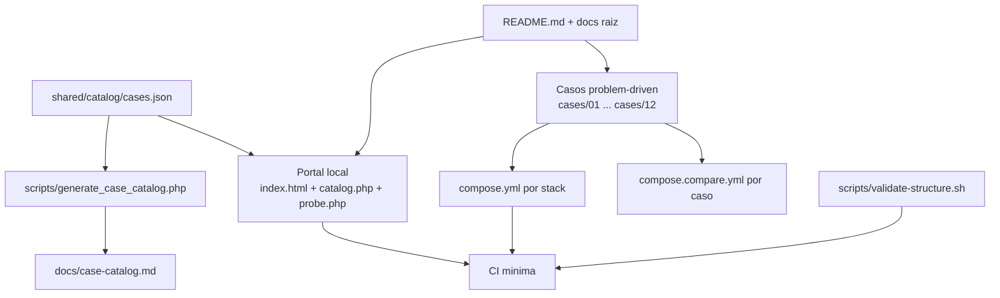

# 🏗️ ARCHITECTURE

> Arquitectura actual del sistema y del repositorio, con foco en la version que hoy vive en `main`.

## 🎯 Resumen ejecutivo

El laboratorio se organiza hoy como un sistema de cuatro capas:

1. una capa editorial y operativa en la raiz;
2. un portal local ligero para evaluacion guiada;
3. un catalogo maestro en metadatos compartidos;
4. casos problem-driven con stacks aislados por Docker.

La fuente de verdad ya no esta repartida entre varios archivos manuales: [`shared/catalog/cases.json`](shared/catalog/cases.json) concentra narrativa de producto, documentos, audiencias, stacks y casos operativos.

## 🧭 Topologia actual

## 🧱 Capas del sistema

### 1. Capa editorial y operativa

- `README.md`, `RECRUITER.md`, `INSTALL.md`, `RUNBOOK.md`, `SECURITY.md`, `SUPPORT.md`, `CONTRIBUTING.md`, `CHANGELOG.md`
- `ARCHITECTURE.md` como vista ejecutiva del sistema actual
- `ROADMAP.md` y `docs/` como mapa de crecimiento y detalle

### 2. Catalogo maestro

`shared/catalog/cases.json` ya concentra:

- identidad del producto;
- `About` y `Topics` recomendados para GitHub;
- documentos y rutas por audiencia;
- metadatos de lenguaje;
- catalogo de casos, impacto de negocio y evidencia esperada;
- runtime entries para los stacks operativos.

Esto elimina la duplicacion manual que antes existia entre el portal, la documentacion y los links operativos.

### 3. Portal local de evaluacion

- `compose.root.yml` levanta solo la landing local
- `portal/app/index.html` presenta la interfaz principal
- `portal/app/catalog.php` transforma el catalogo compartido en payload para la UI
- `portal/app/probe.php` verifica health checks reales y devuelve status code, latencia y timestamp
- `portal/app/index.php` mantiene compatibilidad por redireccion

El portal no intenta levantar todo el laboratorio. Su rol es orientar, explicar y verificar lo que ya esta corriendo.

### 4. Casos y stacks

Cada carpeta en `cases/` representa un problema real. La unidad principal del repositorio no es el lenguaje, sino el problema.

Cada caso contiene carpetas `php`, `node`, `python`, `java` y `dotnet`, con Docker aislado. La paridad funcional depende del estado real del caso, no del simple hecho de que exista la carpeta.

## 📦 Casos operativos actuales

| Caso | Estado | Implementacion real actual |
| --- | --- | --- |
| `01` | operativo | PHP + PostgreSQL + worker + Prometheus + Grafana |
| `02` | operativo | PHP + PostgreSQL |
| `03` | operativo | PHP + Node.js + Python con telemetria y trazabilidad local |
| `04` | operativo | PHP con timeout corto, retry storm comparado, circuit breaker y fallback |
| `05` | operativo | PHP con presion progresiva de memoria/recursos y comparacion legacy vs optimized |
| `06` | operativo | PHP con pipeline legacy vs controlled, preflight y rollback |

## 🔁 Flujo de datos y sincronizacion

La sincronizacion actual se sostiene asi:

1. Se edita [`shared/catalog/cases.json`](shared/catalog/cases.json).
2. El portal consume esos metadatos para renderizar audiencias, documentos, lenguajes y casos operativos.
3. [`scripts/generate_case_catalog.php`](scripts/generate_case_catalog.php) genera [`docs/case-catalog.md`](docs/case-catalog.md).
4. [`scripts/validate-structure.sh`](scripts/validate-structure.sh) y la CI validan que el catalogo siga alineado.

Con esto se reduce mucho el riesgo de drift entre lo que el repo dice, lo que muestra el portal y lo que realmente se puede ejecutar.

## 🐳 Modelo Docker

| Pieza | Rol |
| --- | --- |
| `compose.root.yml` | portal del laboratorio |
| `cases/<caso>/<stack>/compose.yml` | escenario concreto y aislado |
| `cases/<caso>/compose.compare.yml` | comparacion entre stacks del mismo caso |

Regla de oro: Docker aqui sirve para reproducibilidad y comparacion, no para inflar complejidad.

## ✅ Validacion y delivery

La arquitectura actual queda sostenida por cuatro mecanismos:

- validacion estructural del arbol y ausencia de artefactos versionados;
- chequeo del catalogo generado desde metadatos;
- validacion de `docker compose config` para portal y stacks operativos;
- smoke boots y prueba del `probe.php` del portal en CI.

## 📚 Documentos relacionados

- [README.md](README.md)
- [docs/architecture.md](docs/architecture.md)
- [docs/docker-strategy.md](docs/docker-strategy.md)
- [docs/case-catalog.md](docs/case-catalog.md)
