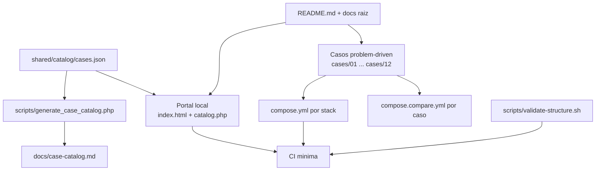

# 🏗️ ARCHITECTURE

> Arquitectura actual del sistema y del repositorio, con foco en la version que hoy vive en `main`.

## 🎯 Resumen ejecutivo

El laboratorio esta organizado como un sistema de cuatro capas:

1. una capa editorial y operativa en la raiz;
2. un portal local ligero con una portada HTML y un backend PHP minimo para metadatos;
3. una biblioteca de casos problem-driven;
4. implementaciones por stack aisladas con Docker.

Desde esta iteracion, el catalogo del laboratorio deja de duplicarse manualmente entre el portal y la documentacion: la fuente de verdad pasa a ser [`shared/catalog/cases.json`](shared/catalog/cases.json).

## 🧭 Topologia actual

## 🧱 Capas del sistema

### 1. Capa raiz

- `README.md`, `RECRUITER.md`, `INSTALL.md`, `RUNBOOK.md`, `SECURITY.md`, `SUPPORT.md`, `CONTRIBUTING.md`, `CHANGELOG.md`
- `ARCHITECTURE.md` como vista ejecutiva del sistema actual
- `ROADMAP.md` y `docs/` como mapa de crecimiento y detalle

### 2. Portal local

- `compose.root.yml` levanta solo la landing local
- `portal/app/index.html` presenta una entrada clara para personas tecnicas y no tecnicas
- `portal/app/catalog.php` entrega el catalogo operativo al frontend
- `portal/app/index.php` mantiene compatibilidad por redireccion
- el portal no intenta ejecutar todo el laboratorio; solo orienta y resume

### 3. Casos

Cada carpeta en `cases/` representa un problema real. La unidad principal del repositorio no es el lenguaje, sino el problema.

### 4. Stacks

Cada caso contiene carpetas `php`, `node`, `python`, `java` y `dotnet`, con Docker aislado. La paridad funcional depende del estado real del caso, no del simple hecho de que exista la carpeta.

## 📦 Casos operativos actuales

| Caso | Estado | Implementacion real actual |
| --- | --- | --- |
| `01` | operativo | PHP + PostgreSQL + worker + Prometheus + Grafana |
| `02` | operativo | PHP + PostgreSQL |
| `03` | operativo | PHP + Node.js + Python con telemetria y trazabilidad local |

## 🔁 Flujo de catalogo y portal

La fuente de verdad del catalogo ahora vive en [`shared/catalog/cases.json`](shared/catalog/cases.json).

- El portal lee esos metadatos para pintar tarjetas, estados y rutas por lenguaje.
- [`scripts/generate_case_catalog.php`](scripts/generate_case_catalog.php) genera [`docs/case-catalog.md`](docs/case-catalog.md).
- La CI puede verificar que el catalogo generado siga sincronizado.

Esto elimina una de las duplicaciones manuales mas visibles del repositorio.

## 🐳 Modelo Docker

| Pieza | Rol |
| --- | --- |
| `compose.root.yml` | portal del laboratorio |
| `cases/<caso>/<stack>/compose.yml` | escenario concreto y aislado |
| `cases/<caso>/compose.compare.yml` | comparacion entre stacks del mismo caso |

Regla de oro: Docker aqui sirve para reproducibilidad y comparacion, no para inflar complejidad.

## ✅ Validacion y delivery

La arquitectura actual queda sostenida por tres mecanismos:

- validacion estructural del arbol y ausencia de artefactos versionados;
- generacion y chequeo del catalogo desde metadatos;
- CI minima con validacion de `docker compose` y smoke boot de escenarios livianos.

## 📚 Documentos relacionados

- [README.md](README.md)
- [docs/architecture.md](docs/architecture.md)
- [docs/docker-strategy.md](docs/docker-strategy.md)
- [docs/case-catalog.md](docs/case-catalog.md)
