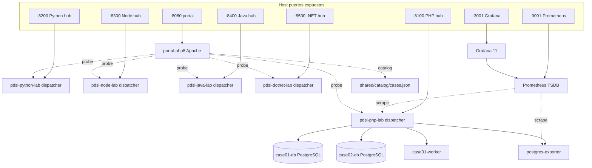
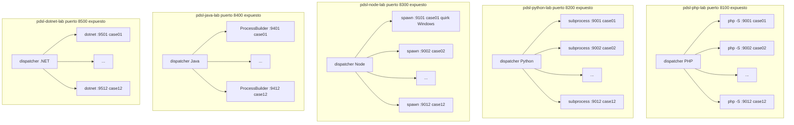
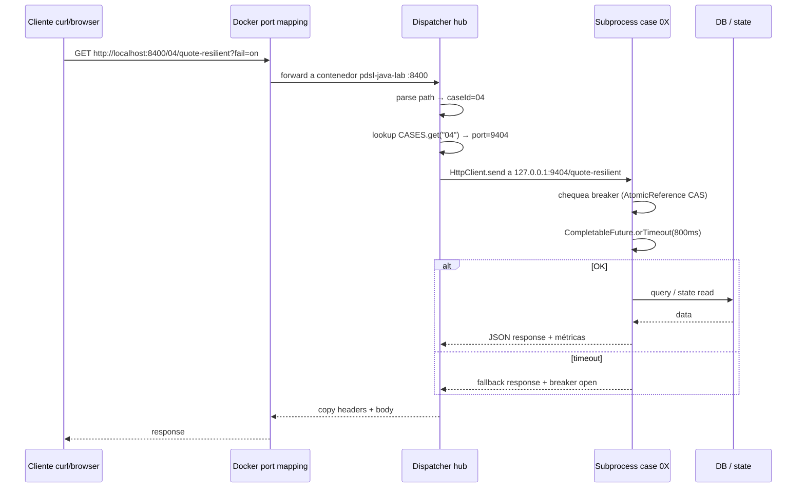
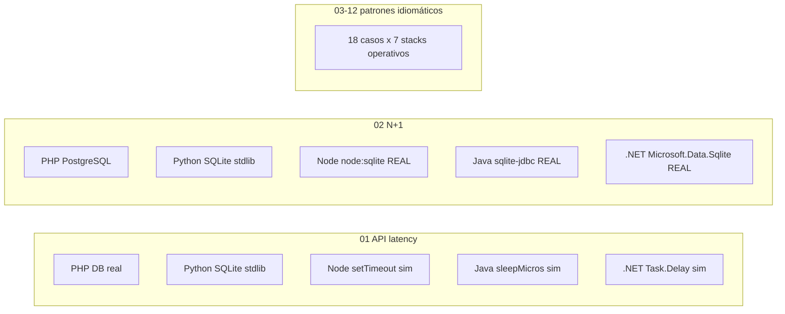
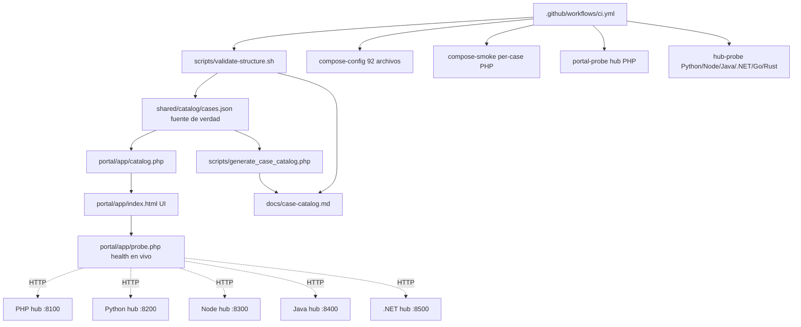

# 🏗️ ARCHITECTURE

> Arquitectura actual del sistema y del repositorio, con foco en la versión que hoy vive en `main`.

## 🎯 Resumen ejecutivo

El laboratorio se organiza hoy como un sistema de cuatro capas:

1. una capa editorial y operativa en la raíz;
2. un portal local ligero para evaluación guiada, más entradas completas por lenguaje (PHP, Python, Node.js, Java 21 y .NET 8 operativos, cada uno con su propio compose raíz);
3. un catálogo maestro en metadatos compartidos;
4. casos problem-driven con stacks aislados por Docker.

La fuente de verdad ya no está repartida entre varios archivos manuales: [`shared/catalog/cases.json`](shared/catalog/cases.json) concentra narrativa de producto, documentos, audiencias, stacks y casos operativos.

**Estado a la fecha:** 7 stacks operativos × 18 casos = **126 endpoints** detrás de 7 hubs simétricos.

---

## 🗺️ Topología del lab (vista global)

```mermaid
graph TB
    subgraph HOST[Host puertos expuestos]
        P8080[":8080 portal"]
        P8100[":8100 PHP hub"]
        P8200[":8200 Python hub"]
        P8300[":8300 Node hub"]
        P8400[":8400 Java hub"]
        P8500[":8500 .NET hub"]
        P9091[":9091 Prometheus"]
        P3001[":3001 Grafana"]
    end

    P8080 --> PORTAL[portal-php8 Apache]
    P8100 --> PHP[pdsl-php-lab dispatcher]
    P8200 --> PY[pdsl-python-lab dispatcher]
    P8300 --> NODE[pdsl-node-lab dispatcher]
    P8400 --> JAVA[pdsl-java-lab dispatcher]
    P8500 --> NET[pdsl-dotnet-lab dispatcher]

    PHP --> PG1[(case01-db PostgreSQL)]
    PHP --> PG2[(case02-db PostgreSQL)]
    PHP --> WORKER[case01-worker]
    PHP --> EXPORTER[postgres-exporter]

    P9091 --> PROM[Prometheus TSDB]
    PROM -.scrape.-> EXPORTER
    PROM -.scrape.-> PHP
    P3001 --> GRAF[Grafana 11]
    GRAF --> PROM

    PORTAL -.catalog.-> CATALOG[shared/catalog/cases.json]
    PORTAL -.probe.-> PHP
    PORTAL -.probe.-> PY
    PORTAL -.probe.-> NODE
    PORTAL -.probe.-> JAVA
    PORTAL -.probe.-> NET
```

**Lectura clave:** 10 puertos cubren todo el laboratorio. 7 son hubs de lenguaje (uno por stack), 1 es el portal, 2 son observabilidad PHP-only. Los servicios reales del caso 01 PHP (PostgreSQL × 2, worker, exporter, Prometheus, Grafana) son contenedores aparte porque **no son procesos del lenguaje** — son los servicios que el caso estudia.

---

## 🧱 Capas del sistema

### 1. Capa editorial y operativa

- `README.md`, `RECRUITER.md`, `INSTALL.md`, `RUNBOOK.md`, `SECURITY.md`, `SUPPORT.md`, `CONTRIBUTING.md`, `CHANGELOG.md`
- `ARCHITECTURE.md` como vista ejecutiva del sistema actual
- `AWS_MIGRATION.md` como plan de despliegue cloud
- `ROADMAP.md` y `docs/` como mapa de crecimiento y detalle

**Por qué importa:** la documentación no es decorativa — separa rutas por audiencia (recruiter, CTO, developer, security) para que cada lector pueda evaluar el repo en <10 minutos sin tener que leerlo todo.

### 2. Catálogo maestro

`shared/catalog/cases.json` ya concentra:

- identidad del producto;
- `About` y `Topics` recomendados para GitHub;
- documentos y rutas por audiencia;
- metadatos de lenguaje;
- catálogo de casos, impacto de negocio y evidencia esperada;
- runtime entries para los stacks operativos.

**Por qué importa:** elimina la duplicación manual que antes existía entre el portal, la documentación generada y los links operativos. El portal renderiza desde acá; `scripts/generate_case_catalog.php` genera `docs/case-catalog.md` desde acá; la CI valida que estén sincronizados.

### 3. Portal local y stacks por lenguaje

Cada lenguaje operativo tiene su compose raíz — un comando levanta los 18 casos de ese lenguaje:

| Archivo | Lenguaje | Puerto hub | Observaciones |
|---|---|---|---|
| `compose.root.yml` | PHP 8.3 | `:8100` | + portal `:8080`, Prometheus `:9091`, Grafana `:3001`, RDS × 2 internos |
| `compose.python.yml` | Python 3.12 | `:8200` | 18 casos en un solo contenedor dispatcher, stdlib pura |
| `compose.nodejs.yml` | Node.js 20 | `:8300` | 18 casos en un solo contenedor, stdlib pura |
| `compose.java.yml` | Java 21 | `:8400` | 18 casos en un solo contenedor, JDK built-in (`HttpServer`, `HttpClient`) |
| `compose.dotnet.yml` | .NET 8 | `:8500` | 18 casos en un solo contenedor, BCL built-in (`HttpListener`, `System.Text.Json`) |
| `compose.go.yml` | Go 1.23 | `:8600` | 18 casos en un solo contenedor, stdlib (`net/http`, `encoding/json`, `httputil.ReverseProxy`) |
| `compose.rust.yml` | Rust 1.83 | `:8700` | 18 casos en un solo contenedor; `std` **no** trae HTTP ni JSON — capa propia sobre `TcpListener` |
| `compose.portal.yml` | — | `:8080` | portal liviano solamente |

Los siete stacks pueden correr en paralelo sin colisión de puertos — comparten el mismo patrón hub.

**Por qué importa:** un solo `docker compose up` por stack es la promesa de reproducibilidad. Cualquier evaluador puede levantar uno o los siete en simultáneo en su laptop.

### 4. Casos, stacks e interfaces de usuario

Cada carpeta en `cases/` representa un problema real. **La unidad principal del repositorio no es el lenguaje, sino el problema.**

Cada caso contiene subcarpetas `php`, `python`, `node`, `java`, `dotnet` con Docker aislado y `comparison.md` explicando cómo cada stack resuelve el mismo problema con primitivas idiomáticas distintas.

**Interfaz Visual Inyectada (Native UI):**
Los 18 casos operativos en PHP detectan `Accept: text/html` y devuelven un **dashboard nativo construido en Vanilla JS/CSS** (`ui.php`), sin frameworks. Esto permite que recruiters y líderes *vean* el problema sin tener que hacer `curl`.

**Alta fidelidad técnica (Fail-by-Design):**
El laboratorio implementa fallos reales — bloqueos de disco con `flock`, saturación de CPU por serialización recursiva, presión real de memoria con LRU/`Process.WorkingSet64`, jerarquías de excepciones nativas — no simulaciones matemáticas.

---

## 🐳 Modelo de containerización (simétrico para los 7 stacks)

Los siete hubs siguen el **mismo patrón**: un contenedor por lenguaje ejecuta sus 18 casos como subprocesos internos en puertos no expuestos.

```mermaid
graph TB
    subgraph PHP_HUB[pdsl-php-lab puerto 8100 expuesto]
        DPHP[dispatcher PHP]
        DPHP --> SP1["php -S :9001 case01"]
        DPHP --> SP2["php -S :9002 case02"]
        DPHP --> SPDOTS["..."]
        DPHP --> SP12["php -S :9012 case12"]
    end

    subgraph PY_HUB[pdsl-python-lab puerto 8200 expuesto]
        DPY[dispatcher Python]
        DPY --> PYS1["subprocess :9001 case01"]
        DPY --> PYS2["subprocess :9002 case02"]
        DPY --> PYSDOTS["..."]
        DPY --> PYS12["subprocess :9012 case12"]
    end

    subgraph NODE_HUB[pdsl-node-lab puerto 8300 expuesto]
        DNODE[dispatcher Node]
        DNODE --> NS1["spawn :9101 case01 quirk Windows"]
        DNODE --> NS2["spawn :9002 case02"]
        DNODE --> NSDOTS["..."]
        DNODE --> NS12["spawn :9012 case12"]
    end

    subgraph JAVA_HUB[pdsl-java-lab puerto 8400 expuesto]
        DJAVA[dispatcher Java]
        DJAVA --> JS1["ProcessBuilder :9401 case01"]
        DJAVA --> JSDOTS["..."]
        DJAVA --> JS12["ProcessBuilder :9412 case12"]
    end

    subgraph NET_HUB[pdsl-dotnet-lab puerto 8500 expuesto]
        DNET[dispatcher .NET]
        DNET --> NTS1["dotnet :9501 case01"]
        DNET --> NTSDOTS["..."]
        DNET --> NTS12["dotnet :9512 case12"]
    end
```

### Conteo de contenedores por stack

| Stack | Contenedores | Detalle |
|---|---|---|
| PHP | **~7** | 1 dispatcher con 12 subprocesos + 2 PostgreSQL + worker + exporter + Prometheus + Grafana. Los 6 extras son **servicios reales del caso 01**, no procesos PHP. |
| Python | **1** | dispatcher con 12 subprocesos `subprocess.Popen` internos |
| Node | **1** | dispatcher con 12 subprocesos `child_process.spawn` internos |
| Java | **1** | dispatcher con 12 `ProcessBuilder` (`java Main`) internos |
| .NET | **1** | dispatcher con 12 subprocesos `dotnet` internos |

**Por qué la asimetría existe y por qué es honesta:** el caso 01 PHP estudia contención real de DB. Eso requiere una PostgreSQL real, un worker real que actualice cache en background, y observabilidad real (Prometheus + Grafana) para que el visitante pueda *ver* la contención disolviéndose. Los otros stacks tienen los mismos patrones de solución (worker + cache + readers no bloqueados) pero contra substrato simulado para caso 01 — esa asimetría está documentada explícitamente en cada `comparison.md` y en el [ROADMAP Eje 2](ROADMAP.md#fidelidad-universal-de-caso-01) como deuda.

Refactor reciente: PHP pasó de ~20 contenedores (12 apps + nginx hub) a ~7 contenedores (1 dispatcher + servicios reales). RAM cae de ~2.5 GB a ~1 GB. **Trade-offs y rationale en [`docs/docker-strategy.md`](docs/docker-strategy.md#-modelo-de-containerización-simétrico-para-los-stacks-operativos).**

---

## 🔁 Flujo de request: cliente → hub → caso

```mermaid
sequenceDiagram
    participant C as Cliente curl/browser
    participant D as Docker port mapping
    participant H as Dispatcher hub
    participant S as Subprocess case 0X
    participant DB as DB / state

    C->>D: GET http://localhost:8400/04/quote-resilient?fail=on
    D->>H: forward a contenedor pdsl-java-lab :8400
    H->>H: parse path → caseId=04
    H->>H: lookup CASES.get("04") → port=9404
    H->>S: HttpClient.send a 127.0.0.1:9404/quote-resilient
    S->>S: chequea breaker (AtomicReference CAS)
    S->>S: CompletableFuture.orTimeout(800ms)
    alt OK
        S->>DB: query / state read
        DB-->>S: data
        S-->>H: JSON response + métricas
    else timeout
        S-->>H: fallback response + breaker open
    end
    H-->>D: copy headers + body
    D-->>C: response
```

**Lectura clave:** los subprocesos de caso son aislados (un memory leak en `case05` no afecta a `case04`), pero **comparten el contenedor del lenguaje** — el failure domain es por hub, no por caso. Esto es trade-off consciente: optimiza RAM (1 GB vs 2.5 GB) a costa de aislamiento estricto. Si un caso necesita aislamiento extremo (caso 11 para medir event_loop_lag sin ruido), existe `cases/11/<stack>/compose.yml` per-case.

---

## 📦 Casos operativos actuales

```mermaid
graph LR
    subgraph C01[01 API latency]
        C01_PHP[PHP DB real]
        C01_PY[Python SQLite stdlib]
        C01_NODE[Node setTimeout sim]
        C01_JAVA[Java sleepMicros sim]
        C01_NET[.NET Task.Delay sim]
    end

    subgraph C02[02 N+1]
        C02_PHP[PHP PostgreSQL]
        C02_PY[Python SQLite stdlib]
        C02_NODE[Node node:sqlite REAL]
        C02_JAVA[Java sqlite-jdbc REAL]
        C02_NET[.NET Microsoft.Data.Sqlite REAL]
    end

    subgraph C03_12[03-12 patrones idiomáticos]
        OTHER[18 casos x 7 stacks operativos]
    end
```

### Mapa de fidelidad por caso

| Caso | Substrato / primitiva por stack | Estado |
|---|---|---|
| `01` API latency | **SQL real en los 7.** PostgreSQL+worker (PHP) · SQLite stdlib+thread (Python) · `node:sqlite` (Node) · `sqlite-jdbc`+WAL (Java) · `Microsoft.Data.Sqlite`+WAL (.NET) · `modernc.org/sqlite`+WAL (Go) · `rusqlite` bundled+WAL (Rust) | OPERATIVO, fidelidad universal |
| `02` N+1 | **SQL real en los 7.** Mismos motores que el caso 01; `db_hits` cuenta ejecuciones contra el motor | OPERATIVO, fidelidad universal |
| `03` Observabilidad | correlation_id: `ThreadLocal` (Java) · `AsyncLocal` (.NET) · `AsyncLocalStorage` (Node) · **`context.Context` explícito + `log/slog` (Go)** · **`&RequestCtx` con lifetime acotado (Rust)** | OPERATIVO |
| `04` Timeout chain | `AbortController` (Node) · `orTimeout` (Java) · `CancellationTokenSource` (.NET) · **`context.WithTimeout` que cancela aguas abajo (Go)** · `mpsc::recv_timeout` (Rust, corta la espera no el trabajo) | OPERATIVO |
| `05` Memory pressure | heap V8 (Node) · `LinkedHashMap` LRU (Java) · LRU manual (.NET) · `container/list` + `runtime.ReadMemStats` (Go) · **`impl Drop` que cuenta liberaciones, sin GC (Rust)** | OPERATIVO |
| `06` Pipeline roto | `record` + state machine (Java/.NET) · `sync.Mutex` sobre la transacción completa (Go) · **`enum` + `match` exhaustivo (Rust)** | OPERATIVO |
| `07` Strangler | `Map<consumer,handler>` (Node) · `ConcurrentHashMap` (Java) · `ConcurrentDictionary` (.NET) · `map[string]handlerFunc` (Go) · **`Box<dyn Fn + Send + Sync>` (Rust)** | OPERATIVO |
| `08` Extract & proxy | `Proxy`+`EventEmitter` (Node) · `CopyOnWriteArrayList` (Java) · `ImmutableList<Action>` (.NET) · **canal con `select`+`default` (Go)** · **`mpsc` single-consumer (Rust)** | OPERATIVO |
| `09` Adapter + breaker | `AbortSignal.timeout` (Node) · `Semaphore` (Java) · `SemaphoreSlim` (.NET) · **`chan struct{}` como semáforo (Go)** · `Mutex<i64>` con guard automático (Rust) | OPERATIVO |
| `10` Right-sized | hops JSON (Node) · `StringBuilder` (Java) · `JsonSerializer` LOH (.NET) · `strings.Builder` (Go) · `String::with_capacity` (Rust) | OPERATIVO |
| `11` Heavy reporting | `monitorEventLoopDelay` (Node) · `ThreadPoolExecutor` (Java) · `ConcurrentExclusiveSchedulerPair` (.NET) · **semáforo de concurrencia — Go y Rust no tienen pool que agotar** | OPERATIVO |
| `12` Bus factor | `?.` (Node) · `Optional<T>` (Java) · NRT (.NET) · comma-ok + `recover()` (Go) · **`Option<T>` + `?`, `match` exhaustivo (Rust)** | OPERATIVO |

**Lectura clave:** los casos `01` y `02` ya no tienen asimetría de fidelidad — los 7 stacks ejecutan SQL real. La única asimetría que queda es de naturaleza del motor: solo PHP cruza un socket TCP contra PostgreSQL externo; los otros seis embeben SQLite. Del `03` al `12` son patrones puros — no requieren substrato externo, solo primitivas idiomáticas del lenguaje.

**✅ OPERATIVO** = lógica real, Docker funcional, evidencia observable. Ver `comparison.md` por caso para profundidad.

---

## 🔁 Flujo de datos y sincronización del catálogo

```mermaid
graph TB
    JSON[shared/catalog/cases.json fuente de verdad]
    JSON --> CATALOG_PHP[portal/app/catalog.php]
    JSON --> GEN[scripts/generate_case_catalog.php]

    CATALOG_PHP --> INDEX[portal/app/index.html UI]
    INDEX --> PROBE[portal/app/probe.php health en vivo]
    PROBE -.HTTP.-> PHP_HUB[PHP hub :8100]
    PROBE -.HTTP.-> PY_HUB[Python hub :8200]
    PROBE -.HTTP.-> NODE_HUB[Node hub :8300]
    PROBE -.HTTP.-> JAVA_HUB[Java hub :8400]
    PROBE -.HTTP.-> NET_HUB[.NET hub :8500]

    GEN --> CATMD[docs/case-catalog.md]

    VAL[scripts/validate-structure.sh]
    VAL --> JSON
    VAL --> CATMD

    CI[.github/workflows/ci.yml]
    CI --> VAL
    CI --> CONFIG[compose-config 92 archivos]
    CI --> SMOKE[compose-smoke per-case PHP]
    CI --> PPROBE[portal-probe hub PHP]
    CI --> HPROBE[hub-probe Python/Node/Java/.NET/Go/Rust]
```

**Lectura clave:** drift entre lo que dice el repo, lo que muestra el portal y lo que se ejecuta queda bloqueado por CI. Si cualquiera de los tres se sale, no merge.

---

## 🎨 Decisiones de diseño (con su porqué)

### 1. Problema-driven, no tecnología-driven

**Decisión:** la unidad atómica del repo es el problema (`cases/01-api-latency-under-load/`), no el lenguaje.

**Por qué:** los portfolios típicos organizan por "soy X developer". Este se organiza por "qué problemas sé diagnosticar y resolver". Demostrar que `ConcurrentHashMap` (Java), `ConcurrentDictionary` (.NET), `Map` (JS) y `dict` (Python) resuelven el mismo problema con primitivas distintas es más valioso que cualquier sintaxis pulida en un solo stack.

### 2. Hubs simétricos por lenguaje

**Decisión:** un compose raíz por lenguaje (`compose.<lang>.yml`) que levanta los 18 casos de ese lenguaje en un solo contenedor con subprocesos internos.

**Por qué:** un solo comando = una sola superficie evaluable. Los 7 stacks pueden correr en paralelo sin colisión de puertos. Si querés evaluar solo Python, no levantes los otros 6. Trade-off consciente: failure domain por hub, no por caso — para casos que necesitan aislamiento estricto existe `cases/0X/<stack>/compose.yml`.

### 3. Stdlib y BCL, no frameworks

**Decisión:** los stacks no-PHP usan exclusivamente librería estándar — `HttpServer` JDK en Java, `HttpListener` BCL en .NET, `http.server` en Python, `node:http` en Node.

**Por qué:** demuestra criterio sobre frameworks. La gracia del lab es que el lector senior **vea** la primitiva idiomática del runtime, no el azúcar sintáctico de un framework de moda. Además simplifica el Dockerfile a un orden de magnitud.

### 4. Honestidad de fidelidad explícita

**Decisión:** cada `comparison.md` con substrato no uniforme entre stacks tiene una sección "Fidelidad del substrato" al inicio. El `README.md` tiene una sección "Honestidad de fidelidad". El [ROADMAP](ROADMAP.md) tiene "Fidelidad universal de caso 01" como deuda explícita.

**Por qué:** la industria entera de portfolios esconde lo incompleto. Este repo prefiere admitirlo. Un senior reviewer detecta los gaps en 30 segundos — vale más declararlos primero que ser pillado.

### 5. Docker es la vía oficial

**Decisión:** `docker compose up` es el método soportado. `make` existe como atajo pero no es la ruta primaria. No hay instrucciones de "instalar PHP 8.3 + Composer + ...".

**Por qué:** reproducibilidad. Cualquier evaluador con Docker Desktop puede levantar el lab en <5 minutos sin tocar su sistema base. Los Dockerfiles son legibles y minimales.

### 6. Portal con probes server-side

**Decisión:** `portal/app/probe.php` ejecuta health checks server-side y devuelve `status code`, `latency_ms`, `last_checked` al cliente.

**Por qué:** el portal no es un índice de docs muerto — es una **demo verificable en vivo**. Un recruiter abre `localhost:8080`, ve verde en los 18 casos del stack que eligió, y sabe que **el repo está vivo en este momento**.

### 7. Catálogo único como fuente de verdad

**Decisión:** `shared/catalog/cases.json` alimenta portal, docs generadas y validación. Editar la lista de casos en cualquier otro lado es un anti-pattern bloqueado por CI.

**Por qué:** previene drift. Cuando agregás un caso, lo agregás en un solo lugar.

---

## 🧪 Trade-offs explícitos de la arquitectura

Cada decisión arquitectónica tiene un costo. Estos son los trade-offs que el lab asume conscientemente:

### Trade-off 1 — Failure domain por hub vs por caso

**Decisión:** los 18 casos de un stack viven en el mismo contenedor (subprocesos del dispatcher).

**Beneficio:** RAM cae de ~2.5 GB a ~1 GB; arranque del stack en <30s; un solo `docker compose up` por stack.

**Costo:** un OOM en `case05` podría afectar a los otros 11 del mismo hub. **Mitigación:** los subprocesos tienen sus propios límites lógicos en el dispatcher; para casos que necesitan aislamiento estricto (caso 11 midiendo `event_loop_lag` sin ruido) existe `cases/11/<stack>/compose.yml` per-case.

### Trade-off 2 — Stdlib pura vs frameworks

**Decisión:** los 4 stacks no-PHP usan `HttpServer` JDK / `HttpListener` BCL / `node:http` / `http.server` — sin frameworks.

**Beneficio:** Dockerfiles minimales, sin lock files, sin árbol de dependencias transitivas. El lector senior ve la primitiva del runtime directamente.

**Costo:** las rutas no son tan ergonómicas como con Express/Spring/ASP.NET. No hay middleware chain automático, no hay validación declarativa, no hay JSON binding. **Justificación:** la gracia del lab es demostrar criterio sobre primitivas, no productividad framework-driven.

### Trade-off 3 — PostgreSQL real solo en PHP para caso 01

**Decisión:** PHP corre contra PostgreSQL en contenedor separado con worker dedicado. Python corre contra SQLite stdlib en thread. Node/Java/.NET simulan el substrato con `setTimeout`/`sleepMicros`/`Task.Delay`.

**Beneficio:** PHP entrega evidencia visual completa (Prometheus + Grafana muestran la contención disolviéndose). Los otros 4 stacks aplican el mismo patrón de solución (worker + cache + readers no bloqueados) sin la complejidad de orquestar 5 DBs.

**Costo:** asimetría de fidelidad. **Mitigación:** declarada en `comparison.md` de cada caso, en README raíz "Honestidad de fidelidad" y en [ROADMAP Eje 2](ROADMAP.md#fidelidad-universal-de-caso-01) como deuda con plan concreto.

### Trade-off 4 — Catálogo único en JSON vs DSL propio

**Decisión:** `shared/catalog/cases.json` es la fuente de verdad. Plain JSON, sin schema validator dedicado.

**Beneficio:** edición humana directa, diff legible en git, parseable por cualquier lenguaje.

**Costo:** errores tipográficos no son atrapados hasta CI. **Mitigación:** `scripts/validate-structure.sh` + `--check` del generador.

### Trade-off 5 — Portal en PHP+Apache, no en SPA

**Decisión:** portal renderizado server-side con PHP, sin React/Vue/Svelte.

**Beneficio:** SEO trivial, sin build step, sin tooling JS adicional, mismo runtime que el stack PHP del lab.

**Costo:** interactividad limitada a lo que vanilla JS puede hacer sin frameworks. **Justificación:** el portal no es una app, es un índice navegable con probes server-side.

---

## ✅ Validación y delivery

La arquitectura actual queda sostenida por seis mecanismos:

| Mecanismo | Qué chequea |
|---|---|
| `scripts/validate-structure.sh` | Estructura del árbol, archivos requeridos, ausencia de artefactos |
| `scripts/generate_case_catalog.php --check` | Catálogo sincronizado con `cases.json` |
| CI `compose-config` | 92 archivos `compose.yml` parsean sin errores (7 hubs + 84 per-case + portal) |
| CI `compose-smoke` (PHP per-case) | Cada caso PHP arranca y responde `/health` en aislamiento |
| CI `portal-probe` (hub PHP) | El hub PHP `:8100` arranca y el portal resuelve `probe.php` |
| CI `hub-probe` (Python/Node/Java/.NET/Go/Rust) | Cada hub arranca y responde `/01/health`…`/12/health` |

---

## 🐳 Modelo Docker (referencia rápida)

| Pieza | Rol |
|---|---|
| `compose.root.yml` | PHP: portal (`:8080`) + hub (`:8100`) + DB × 2 + worker + Prometheus (`:9091`) + Grafana (`:3001`) |
| `compose.python.yml` | Python: dispatcher único con 18 casos internos (`:8200`) |
| `compose.nodejs.yml` | Node: dispatcher único con 18 casos internos (`:8300`) |
| `compose.java.yml` | Java 21: dispatcher único con 18 casos internos (`:8400`) |
| `compose.dotnet.yml` | .NET 8: dispatcher único con 18 casos internos (`:8500`) |
| `compose.go.yml` | Go 1.23: dispatcher único con 18 casos internos (`:8600`) |
| `compose.rust.yml` | Rust 1.83: dispatcher único con 18 casos internos (`:8700`) |
| `compose.portal.yml` | Portal liviano solamente (`:8080`) |
| `cases/<caso>/<stack>/compose.yml` | Escenario concreto y aislado (estudio individual) |
| `cases/<caso>/compose.compare.yml` | Comparación entre stacks del mismo caso |

**Regla de oro:** Docker aquí sirve para reproducibilidad y comparación, no para inflar complejidad.

---

## 📚 Documentos relacionados

- [README.md](README.md)
- [AWS_MIGRATION.md](AWS_MIGRATION.md)
- [ROADMAP.md](ROADMAP.md)
- [SECURITY.md](SECURITY.md)
- [docs/architecture.md](docs/architecture.md)
- [docs/docker-strategy.md](docs/docker-strategy.md)
- [docs/case-catalog.md](docs/case-catalog.md)
- [docs/executive-summary.md](docs/executive-summary.md)
