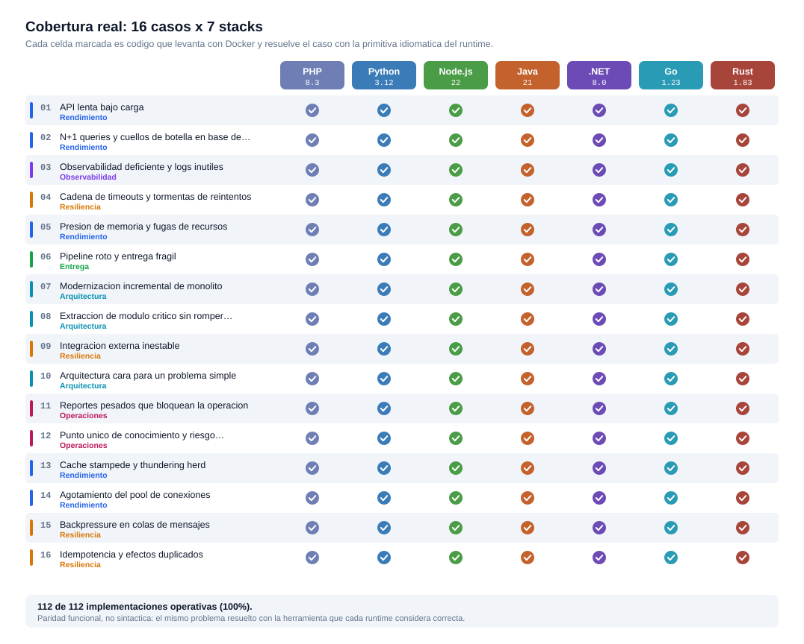

# 🧪 Problem-Driven Systems Lab

[](LICENSE)
[](compose.root.yml)
[](cases/)
[](cases/)
[](cases/)
[](cases/)
[](cases/)
[](cases/)
[](cases/)
[](ROADMAP.md)
[](https://vladimiracunadev-create.github.io/problem-driven-systems-lab/)

Portafolio técnico orientado a problemas reales de software: rendimiento, observabilidad, resiliencia, arquitectura y continuidad operacional. Este repositorio forma parte del ecosistema público de Vladimir Acuña y traduce esa narrativa en escenarios ejecutables, documentados y honestos sobre su madurez real.

> 🌐 **[Explora el laboratorio en la web](https://vladimiracunadev-create.github.io/problem-driven-systems-lab/)** — los 20 casos, los 7 stacks y toda la documentación del
> repositorio publicados como HTML navegable. Nada que descargar, ningún enlace a `.md`.

## 🎯 Executive Summary

- El laboratorio modela **20 problemas reales de ingeniería**, utilizando fallos de alta fidelidad inyectados (I/O, Memoria, Excepciones) en lugar de simulaciones abstractas.
- Los casos `01` al `12` son piezas de ingeniería operativa en **PHP, Python, Node.js, Java 21, .NET 8, Go 1.23 y Rust 1.83** con primitivas nativas distintas por lenguaje (`ConcurrentHashMap`/`ConcurrentDictionary`, `context.WithTimeout`/`CompletableFuture.orTimeout`/`CancellationTokenSource`, `chan struct{}` como semáforo/`Semaphore`/`SemaphoreSlim`, `impl Drop`/`LinkedHashMap` LRU/`container/list`, `Option<T>`+`?`/`Optional<T>`/comma-ok/`?.`, `enum` exhaustivo, `runtime.ReadMemStats`, etc.). El stack PHP incluye **UI nativa** para diagnósticos visuales.
- Implementa patrones profesionales (**Adapter, Strangler, Circuit Breaker, LRU, Cancellation**) resolviendo cuellos de botella reales en cada runtime.
- Docker es la vía oficial de ejecución limpia y reproducible.
- [`shared/catalog/cases.json`](shared/catalog/cases.json) es la fuente de verdad del portal, de la documentacion generada y de la narrativa operativa.
- El portal raiz ahora sirve como hub de evaluacion: rutas por audiencia, seleccion por lenguaje, proof cards y probes server-side.
- ☁️ Plan de despliegue en la nube documentado en [AWS_MIGRATION.md](AWS_MIGRATION.md): tres rutas (ECS Fargate, Lambda, EKS), costos reales estimados, paso a paso, y un **mapping explicito de como AWS mitiga cada hallazgo del [`SECURITY.md`](SECURITY.md)** (auth via Cognito, rate limiting via WAF, atomicidad via DynamoDB, etc.) sin tocar codigo del lab.

## 💻 Interfaz Visual Integrada

El laboratorio no es solo una "API JSON ciega". Los 20 casos en PHP ahora interceptan solicitudes HTTP de navegadores (mediante cabeceras `Accept`) y devuelven **Dashboards Interactivos**. Esto permite a reclutadores, líderes y desarrolladores *ver* cómo se bloquea una base de datos, cómo aumentan las latencias, y probar escenarios en vivo usando estéticas modernas sin afectar el núcleo programático.

## 💡 Que demuestra este producto

| Area | Evidencia concreta |
| --- | --- |
| Diagnostico tecnico | Cada caso parte desde sintomas, causas, trade-offs y solucion esperada |
| Ejecucion reproducible | Cada stack mantiene `Dockerfile` y `compose.yml` propios |
| Operacion realista | Los casos operativos no son demos vacias: usan DB, worker, metricas, logs o trazas segun corresponda |
| Claridad para audiencias mixtas | El portal y la documentacion separan rutas para recruiter, liderazgo tecnico, developer y beginner |
| Honestidad tecnica | Se distingue explicitamente entre `OPERATIVO` y `DOCUMENTADO / SCAFFOLD` |

## 🧭 Como evaluarlo rapido

| Perfil | Punto de entrada | Que deberia poder concluir |
| --- | --- | --- |
| Recruiter / hiring manager | [RECRUITER.md](RECRUITER.md) → [docs/executive-summary.md](docs/executive-summary.md) | El repo deja evidencia real y los 20 casos caben en una pagina ejecutiva |
| CTO / Head of Engineering | [ARCHITECTURE.md](ARCHITECTURE.md) | Hay criterio sistemico, foco en operacion y reduccion de riesgo |
| Developer / DevOps | [INSTALL.md](INSTALL.md) → [RUNBOOK.md](RUNBOOK.md) | El entorno levanta limpio y los casos operativos cuentan una historia tecnica verificable |
| Security engineer | [SECURITY.md](SECURITY.md) | Modelo de amenaza explicito, hallazgos del analisis interno y frontera honesta entre lo que el lab garantiza y lo que no |
| Beginner | [docs/BEGINNERS_GUIDE.md](docs/BEGINNERS_GUIDE.md) | La estructura y la taxonomia de madurez son comprensibles antes de entrar al codigo |

Si quieres una sola puerta de entrada local con los 20 casos PHP disponibles, levanta `docker compose -f compose.root.yml up -d --build` y abre `http://localhost:8080`.

## 🏷️ Madurez actual

| Nivel | Significado |
| --- | --- |
| `OPERATIVO` | Caso resolviendo el problema de forma real, con Docker y evidencia observable |
| `DOCUMENTADO / SCAFFOLD` | Caso bien modelado, con estructura y docs listas, pero sin la misma profundidad funcional todavia |
| `PLANIFICADO` | Futuro del roadmap, aun no presente en el arbol actual |

Estado actual:

- `OPERATIVO` en PHP: todos los casos [01](cases/01-api-latency-under-load/README.md) al [12](cases/12-single-point-of-knowledge-and-operational-risk/README.md), con UI nativa, Prometheus, Grafana y fallos de alta fidelidad.
- `OPERATIVO` en Python: los 20 casos, con logica funcional equivalente a PHP, stdlib pura y autocontenidos en un solo contenedor. En el caso 13 suma un dict de vuelos en curso con `threading.Event` y una barrera de dos fases para que el GIL no produzca un falso verde; en el 14, `queue.Queue(maxsize=N)` COMO pool con `@contextmanager` para la devolucion garantizada; en el 15, la misma `queue.Queue` como cola, con la politica de llenado en la firma de `put()`; en el 16, `dict.setdefault` bajo `Lock` — porque la atomicidad del GIL es un detalle de CPython, no un contrato; en el 17, un read-write lock construido a mano sobre `Condition`, porque la stdlib no trae ninguno; en el 18, imports diferidos — la unica palanca de Python contra su arranque, porque no hay artefacto compilado al que escapar; en el 19, el algebra de conjuntos que da el diagnostico mas corto de los siete; en el 20, la jerarquia de excepciones que clasifica en cuatro lineas — con el `except Exception` a una palabra de arruinarlo.
- `OPERATIVO` en Node.js: los **20 casos**, con primitivas Node-especificas distintas por caso (event loop lag, **SQLite real via `node:sqlite` built-in en caso 02**, `AbortController`, `AbortSignal.timeout`, `process.memoryUsage()`, `Map<consumer, handler>` strangler, `Proxy` de compatibilidad, `EventEmitter`, `monitorEventLoopDelay`, optional chaining como runbook codificado, **`Map<key, Promise>` como el single-flight mas corto del lab (13)**, `AbortSignal.timeout` + `finally` sobre un pool cuyo waiter es una Promise invisible (14), **`stream.Writable` con `highWaterMark` y el evento `drain` — el unico backpressure que es parte del protocolo del runtime (15)**, `Map` como tabla de idempotencia: atomico por el modelo de un solo hilo, y por eso incorrecto con dos procesos (16), **el event loop COMO lock exclusivo: un bucle sincronico no bloquea una tabla, bloquea el proceso entero (17)**, `--build-snapshot` como el AOT parcial de Node, con el cold start real viviendo en el grafo de `require` (18), **el `await` que falta: el unico stack del lab donde el bug se produce por NO escribir algo (19)**, `instanceof` fragil por diseño para clasificar errores, que se rompe entre copias de paquete y workers (20)).
- `OPERATIVO` en Java 21: los **20 casos**, con primitivas JDK-distintas por caso: `ConcurrentHashMap` summary cache + `ScheduledExecutorService` worker (01), **SQLite real via `sqlite-jdbc` + `PreparedStatement` + batch `IN(?, ...)` (02)**, `ThreadLocal<RequestContext>` correlation (03), `CompletableFuture.orTimeout` + `AtomicReference<BreakerState>` CAS (04), `LinkedHashMap.removeEldestEntry` LRU + `Runtime` metrics (05), `record` types + state machine (06), `ConcurrentHashMap<String,Function>` routing mutable (07), `Function` proxy + `CopyOnWriteArrayList<Consumer>` event bus (08), `Semaphore` budget + snapshot cache + `AtomicReference` breaker (09), `HashMap` O(1) vs N hops `StringBuilder` (10), `ThreadPoolExecutor.getActiveCount()` saturation observable + `ExecutorService` dedicado (11), `Optional<T>` + `map/orElse` como runbook codificado (12), **`ConcurrentHashMap.computeIfAbsent` atomico por clave + `CompletableFuture` compartido (13)**, try-with-resources sobre `ArrayBlockingQueue` con `poll(timeout)` — el compilador escribe el `finally` (14), `put`/`offer`/`offer(timeout)` como taxonomia de rechazo, con `ConcurrentLinkedQueue` de contraejemplo sin capacidad (15), `ConcurrentHashMap.putIfAbsent` que resuelve la carrera y dice quien gano en una llamada (16), **`ReentrantReadWriteLock` en modo justo con `tryLock(timeout)` — el unico stack con deadline y equidad de fabrica (17)**, y la compilacion en capas C1/C2 medida en **51,9x**: el arranque en frio canonico del lab (18), `ConcurrentSkipListMap.tailMap` como consulta natural de lo pendiente del outbox — y `@Transactional`, que sugiere una atomicidad que no alcanza al indice (19), **jerarquias `sealed ... permits`: la clasificacion de errores mas expresiva del set (20)**.
- `OPERATIVO` en .NET 8: los **20 casos**, con primitivas BCL-distintas por caso: `ConcurrentDictionary` summary cache + `Task.Delay` worker con `CancellationToken` (01), **SQLite real via `Microsoft.Data.Sqlite` + `SqliteCommand` + batch `IN(@id0, ...)` (02)**, `AsyncLocal<RequestContext>` para correlation_id en pipeline async (03), `CancellationTokenSource` con timeout + breaker `Interlocked` CAS (04), LRU manual con `Dictionary + LinkedList` + `Process.WorkingSet64` (05), `ConcurrentDictionary<string,EnvState>` + máquina de estados con rollback automático (06), `Func<Request,Response>` delegate routing + `record` types (07), `ImmutableList<Action<string>>` + `Func<Old,New>` proxy con cutover gradual (08), `MemoryCache`/`ConcurrentDictionary` snapshot + `SemaphoreSlim` budget + `Interlocked.CompareExchange` breaker (09), lookup directo `Dictionary` vs N hops `JsonSerializer` con presión LOH (10), `ConcurrentExclusiveSchedulerPair` o `Thread` dedicado + `ThreadPool.GetAvailableWorkerThreads` (11), `?.`/`??` con Nullable Reference Types como runbook codificado en el sistema de tipos (12), **`Lazy<Task<T>>` con `ExecutionAndPublication` porque `GetOrAdd` no garantiza fabrica unica (13)**, `SemaphoreSlim.WaitAsync(timeout)` que devuelve `false` en vez de lanzar + `using var` (14), **`Channel.CreateBounded` con `BoundedChannelFullMode` como enum del constructor y callback de descarte (15)**, `ConcurrentDictionary.TryAdd` — atomico de verdad, a diferencia del `GetOrAdd` con fabrica del caso 13 (16), `ReaderWriterLockSlim` con `TryEnterReadLock(ms)` — deadline como valor de retorno, y un lock `IDisposable` en un runtime con GC (17), `PublishReadyToRun` y `PublishAot` — la respuesta al arranque en frio en tres lineas del `.csproj` (18), `Except` y `Join` para expresar las tres caras de una deriva como consultas tipadas, con la pereza de LINQ como trampa (19), **filtros de excepcion `catch (e) when (...)`: la unica primitiva del lab que decide ANTES de desenrollar la pila (20)**.
- `OPERATIVO` en Go 1.23: los **20 casos**, con primitivas Go-distintas por caso: **SQLite real via `modernc.org/sqlite` (Go puro, sin cgo) con `journal_mode=WAL` (01 y 02)**, `context.Context` como contexto explicito + `log/slog` estructurado de la stdlib (03), **`context.WithTimeout` que cancela de verdad aguas abajo via `select` sobre `ctx.Done()` (04)**, `container/list` como LRU + `runtime.ReadMemStats` sin agente externo (05), `sync.Mutex` protegiendo la transaccion completa en vez de `sync.Map` (06), `map[string]handlerFunc` con la firma como tipo + `RWMutex` (07), **bus de eventos por canal con `select`+`default` que descarta antes que frenar trafico (08)**, **`chan struct{}` bufferizado COMO semaforo de cuota (09)**, `strings.Builder` sin copias vs map O(1) (10), **semaforo de concurrencia en vez de pool — Go no tiene pool que agotar (11)**, comma-ok + `recover()` (12), **`singleflight` escrito a mano en 25 lineas con `sync.WaitGroup` (13)**, canal bufferizado COMO pool con `select` y `defer` (14), **canal bufferizado como cola: no existe el buffer infinito, la version sin tope hay que escribirla a mano (15)**, `sync.Map.LoadOrStore` — el caso donde `sync.Map` SI corresponde, al reves del 13 (16), `sync.RWMutex` sin hambruna de escritor pero sin `RLock` con timeout: el deadline se arma con goroutine y `select` (17), **el binario estatico AOT sin curva de calentamiento y `sync.Once` como la inicializacion perezosa hecha explicita (18)**, el error como valor donde descartarlo hay que escribirlo — `_ =` queda en el diff y `errcheck` lo marca (19), `errors.Is` y `errors.As` sobre cadenas envueltas con `%w`, que acumulan contexto sin perder la causa (20).
- `OPERATIVO` en Rust 1.83: los **20 casos**, con primitivas Rust-distintas por caso: **SQLite real via `rusqlite` feature `bundled` — compila SQLite dentro del binario (01 y 02)**, `&RequestCtx` prestado con lifetimes que impiden que sobreviva al request (03), `mpsc::recv_timeout` (04), **`impl Drop` que cuenta sus propias liberaciones — `dropped_total` observable, unico stack del lab que lo expone (05)**, **`enum` con datos asociados + `match` exhaustivo: agregar una variante rompe la compilacion (06)**, `Box<dyn Fn(..) + Send + Sync>` verificado en el punto de registro (07), `mpsc` con single-consumer impuesto por el tipo (08), `Mutex<i64>` cuyo guard libera en todos los caminos (09), `String::with_capacity` (10), `Mutex`+`Condvar` sin busy-wait (11), **`Option<T>` + operador `?` con `match` exhaustivo: omitir el brazo `None` no compila (12)**, `Arc<Flight>` con `Mutex` + `Condvar` y `wait_while` — la `std` no trae `Future` ejecutable (13), **`impl Drop` que devuelve la conexion sin linea que recordar: fugar exige escribir `mem::forget` a proposito (14)**, `mpsc::sync_channel` con el limite en el TIPO y `TrySendError::Full(T)` devolviendo el mensaje rechazado (15), **`HashMap::entry` con `match` exhaustivo: ignorar el resultado de la reserva no compila (16)**, `RwLock` con spin acotado porque la `std` no trae deadline — el unico caso del lab donde la respuesta de Rust es peor que la de los otros seis (17), **`OnceLock<T>`: la unica primitiva del lab donde el estado 'todavia no inicializada' es inalcanzable por tipos y no solo improbable (18)**, **`#[must_use]` sobre `Result`: el unico stack donde el bug del caso 19 —ignorar una escritura fallida— no compila sin escribirlo a proposito (19)**, **el `enum` de error con `match` exhaustivo, donde una clase nueva no compila hasta que alguien decida que hacer con ella — y `panic!` como canal separado de `Result` (20)**.

## 🔐 Postura de seguridad y modelo de despliegue

**El lab está pensado para correr en `localhost`.** Esa decisión define toda su postura de seguridad — y este repo prefiere ser explícito sobre eso antes que vender una robustez que no implementa.

| Escenario | Riesgo realista | Recomendado |
|---|---|---|
| **Localhost only** (`docker compose up` en tu máquina) | Bajo — el atacante necesita acceso físico o ya está dentro | ✅ caso de uso pensado |
| **LAN / VM con `0.0.0.0`** | Medio — cualquiera del segmento puede llamar `/reset-lab`, intentar DoS | ⚠️ requiere reverse proxy con auth |
| **Internet sin proxy con auth** | Alto/Crítico — sin auth, sin rate limiting, sin TLS | ❌ no exponer así |

**Lo que el código sí garantiza** (verificado por revisión manual): SQL injection bloqueada por prepared statements, validación por allowlist de scenarios/consumers, regex allowlist en SKU/release, clamping numérico en todos los enteros de query, paths fijos sin user input (sin path traversal), spawn de subprocesos con paths fijos del registry (sin RCE), `crypto.randomBytes` para IDs impredecibles, sin `eval`/`exec`/`shell`, fallback seguro en JSON.parse de state corrupto, AbortSignal cooperativo en pipelines.

**Lo que NO garantiza** (intencional, es un lab): autenticación, rate limiting, TLS, validación de método HTTP, headers de seguridad, atomicidad de escrituras de state.

➡️ **[Análisis completo en SECURITY.md](SECURITY.md)** — modelo de amenaza, los 4 hallazgos altos/medios con mitigación concreta, las defensas activas en detalle (con `archivo:línea`), y el checklist mínimo si necesitás exponerlo más allá de localhost.

## 🎯 Honestidad de fidelidad (qué es real vs qué es simulado)

El lab declara explicitamente donde el substrato es real y donde no:

| Caso | PHP | Python | Node.js | Java | .NET | Go | Rust |
|---|---|---|---|---|---|---|---|
| **01 (latencia)** | PostgreSQL real | SQLite stdlib | SQLite `node:sqlite` | SQLite `sqlite-jdbc` (WAL) | SQLite `Microsoft.Data.Sqlite` (WAL) | SQLite `modernc.org/sqlite` (WAL) | SQLite `rusqlite` bundled (WAL) |
| **02 (N+1)** | PostgreSQL real | SQLite stdlib | SQLite `node:sqlite` | SQLite `sqlite-jdbc` | SQLite `Microsoft.Data.Sqlite` | SQLite `modernc.org/sqlite` | SQLite `rusqlite` bundled |

**Los casos 01 y 02 tienen fidelidad universal:** los 7 stacks ejecutan SQL real contra un motor, y `db_hits` / `db_queries_in_request` cuentan ejecuciones reales, no iteraciones de un bucle en memoria. En el caso 01, el filtro no sargable esta verificado con `EXPLAIN QUERY PLAN` (`SCAN orders` vs `SEARCH orders USING INDEX`), no afirmado en prosa.

La unica asimetria que queda es de **naturaleza del motor**, y es deliberada: solo PHP cruza un socket TCP contra un PostgreSQL externo con pool FPM finito. Los otros seis embeben el motor — SQL real y plan de ejecucion real, sin hop de red ni pool remoto. Node y Python compensan con un round-trip artificial explicito y documentado en el codigo. Esta distincion esta detallada en cada `comparison.md`.

**La equivalencia es verificable, no declarada.** Los cuatro stacks compilados generan el dataset con el mismo LCG, asi que `GET /01/report-legacy?limit=5` devuelve la misma primera fila —`order_id 12, Customer 1315, silver, north, 934`— con `db_hits 6` y 1.531 filas en `customer_summary` en Java, .NET, Go y Rust. En el caso 02, Go y Rust coinciden hasta el SKU (`order_id 1, customer_id 276, SKU-2369 qty 2`).

## 🔎 Catálogo de Casos Resolutivos

| Caso | Comparativa | PHP | Python | Node.js | Java 21 | .NET 8 | Go 1.23 | Rust 1.83 | Estado | Que deja como prueba |
| --- | --- | --- | --- | --- | --- | --- | --- | --- | --- | --- |
| [01 - API lenta bajo carga](cases/01-api-latency-under-load/README.md) | [⚖️](cases/01-api-latency-under-load/comparison.md) | [👉](cases/01-api-latency-under-load/php/README.md) | [🐍](cases/01-api-latency-under-load/python/README.md) | [🟢](cases/01-api-latency-under-load/node/README.md) | [☕](cases/01-api-latency-under-load/java/README.md) | [🟦](cases/01-api-latency-under-load/dotnet/README.md) | [🐹](cases/01-api-latency-under-load/go/README.md) | [🦀](cases/01-api-latency-under-load/rust/README.md) | `OPERATIVO` | Latencia legacy vs optimized; metricas Grafana (PHP), event loop lag (Node), `ConcurrentHashMap` summary cache + worker (Java), `ConcurrentDictionary` + `Task.Delay` worker (.NET); `modernc.org/sqlite` + goroutine worker (Go), `rusqlite` bundled + `Drop` (Rust) |
| [02 - N+1 y cuellos de botella DB](cases/02-n-plus-one-and-db-bottlenecks/README.md) | [⚖️](cases/02-n-plus-one-and-db-bottlenecks/comparison.md) | [👉](cases/02-n-plus-one-and-db-bottlenecks/php/README.md) | [🐍](cases/02-n-plus-one-and-db-bottlenecks/python/README.md) | [🟢](cases/02-n-plus-one-and-db-bottlenecks/node/README.md) | [☕](cases/02-n-plus-one-and-db-bottlenecks/java/README.md) | [🟦](cases/02-n-plus-one-and-db-bottlenecks/dotnet/README.md) | [🐹](cases/02-n-plus-one-and-db-bottlenecks/go/README.md) | [🦀](cases/02-n-plus-one-and-db-bottlenecks/rust/README.md) | `OPERATIVO` | N+1 vs batch `IN(...)`; `db_hits` medido en cada stack; `database/sql` sin ORM (Go), `collect::<Result<..>>` no ignorable (Rust) |
| [03 - Observabilidad deficiente](cases/03-poor-observability-and-useless-logs/README.md) | [⚖️](cases/03-poor-observability-and-useless-logs/comparison.md) | [👉](cases/03-poor-observability-and-useless-logs/php/README.md) | [🐍](cases/03-poor-observability-and-useless-logs/python/README.md) | [🟢](cases/03-poor-observability-and-useless-logs/node/README.md) | [☕](cases/03-poor-observability-and-useless-logs/java/README.md) | [🟦](cases/03-poor-observability-and-useless-logs/dotnet/README.md) | [🐹](cases/03-poor-observability-and-useless-logs/go/README.md) | [🦀](cases/03-poor-observability-and-useless-logs/rust/README.md) | `OPERATIVO` | Logs opacos vs telemetria util con correlation_id; `ThreadLocal<RequestContext>` (Java), `AsyncLocal<RequestContext>` (.NET); `context.Context` explicito + `log/slog` (Go), `&RequestCtx` con lifetime acotado (Rust) |
| [04 - Timeout chain y retry storms](cases/04-timeout-chain-and-retry-storms/README.md) | [⚖️](cases/04-timeout-chain-and-retry-storms/comparison.md) | [👉](cases/04-timeout-chain-and-retry-storms/php/README.md) | [🐍](cases/04-timeout-chain-and-retry-storms/python/README.md) | [🟢](cases/04-timeout-chain-and-retry-storms/node/README.md) | [☕](cases/04-timeout-chain-and-retry-storms/java/README.md) | [🟦](cases/04-timeout-chain-and-retry-storms/dotnet/README.md) | [🐹](cases/04-timeout-chain-and-retry-storms/go/README.md) | [🦀](cases/04-timeout-chain-and-retry-storms/rust/README.md) | `OPERATIVO` | Retries agresivos vs CB+fallback; `AbortController` (Node), `CompletableFuture.orTimeout` (Java), `CancellationTokenSource` + `Interlocked.CompareExchange` (.NET); **`context.WithTimeout` cancela aguas abajo** (Go), `mpsc::recv_timeout` (Rust) |
| [05 - Presion de memoria y fugas](cases/05-memory-pressure-and-resource-leaks/README.md) | [⚖️](cases/05-memory-pressure-and-resource-leaks/comparison.md) | [👉](cases/05-memory-pressure-and-resource-leaks/php/README.md) | [🐍](cases/05-memory-pressure-and-resource-leaks/python/README.md) | [🟢](cases/05-memory-pressure-and-resource-leaks/node/README.md) | [☕](cases/05-memory-pressure-and-resource-leaks/java/README.md) | [🟦](cases/05-memory-pressure-and-resource-leaks/dotnet/README.md) | [🐹](cases/05-memory-pressure-and-resource-leaks/go/README.md) | [🦀](cases/05-memory-pressure-and-resource-leaks/rust/README.md) | `OPERATIVO` | Estado retenido vs eviccion; heap V8+RSS (Node), `LinkedHashMap` LRU (Java), LRU manual `Dictionary`+`LinkedList` + `Process.WorkingSet64` (.NET); `container/list` LRU + `runtime.ReadMemStats` (Go), **`impl Drop` que cuenta liberaciones** (Rust) |
| [06 - Pipeline roto y delivery fragil](cases/06-broken-pipeline-and-fragile-delivery/README.md) | [⚖️](cases/06-broken-pipeline-and-fragile-delivery/comparison.md) | [👉](cases/06-broken-pipeline-and-fragile-delivery/php/README.md) | [🐍](cases/06-broken-pipeline-and-fragile-delivery/python/README.md) | [🟢](cases/06-broken-pipeline-and-fragile-delivery/node/README.md) | [☕](cases/06-broken-pipeline-and-fragile-delivery/java/README.md) | [🟦](cases/06-broken-pipeline-and-fragile-delivery/dotnet/README.md) | [🐹](cases/06-broken-pipeline-and-fragile-delivery/go/README.md) | [🦀](cases/06-broken-pipeline-and-fragile-delivery/rust/README.md) | `OPERATIVO` | Detectar tarde vs preflight+rollback; `record` types + state machine (Java/.NET), `with`-expressions para rollback (.NET); `sync.Mutex` sobre la transaccion completa (Go), **`enum` + `match` exhaustivo** (Rust) |
| [07 - Modernización del Monolito](cases/07-incremental-monolith-modernization/README.md) | [⚖️](cases/07-incremental-monolith-modernization/comparison.md) | [👉](cases/07-incremental-monolith-modernization/php/README.md) | [🐍](cases/07-incremental-monolith-modernization/python/README.md) | [🟢](cases/07-incremental-monolith-modernization/node/README.md) | [☕](cases/07-incremental-monolith-modernization/java/README.md) | [🟦](cases/07-incremental-monolith-modernization/dotnet/README.md) | [🐹](cases/07-incremental-monolith-modernization/go/README.md) | [🦀](cases/07-incremental-monolith-modernization/rust/README.md) | `OPERATIVO` | Strangler fig; `Map<consumer,handler>` mutable (Node), `ConcurrentHashMap<String,Function>` (Java), `ConcurrentDictionary<string,Func<Request,Response>>` (.NET); `map[string]handlerFunc` (Go), `Box<dyn Fn + Send + Sync>` (Rust) |
| [08 - Extracción Crítica Módulo](cases/08-critical-module-extraction-without-breaking-operations/README.md) | [⚖️](cases/08-critical-module-extraction-without-breaking-operations/comparison.md) | [👉](cases/08-critical-module-extraction-without-breaking-operations/php/README.md) | [🐍](cases/08-critical-module-extraction-without-breaking-operations/python/README.md) | [🟢](cases/08-critical-module-extraction-without-breaking-operations/node/README.md) | [☕](cases/08-critical-module-extraction-without-breaking-operations/java/README.md) | [🟦](cases/08-critical-module-extraction-without-breaking-operations/dotnet/README.md) | [🐹](cases/08-critical-module-extraction-without-breaking-operations/go/README.md) | [🦀](cases/08-critical-module-extraction-without-breaking-operations/rust/README.md) | `OPERATIVO` | Big bang vs extract-and-proxy + cutover; `Proxy`+`EventEmitter` (Node), `Function` proxy + `CopyOnWriteArrayList` (Java), `Func<Old,New>` + `ImmutableList<Action<string>>` event bus (.NET); canal con `select`+`default` (Go), `mpsc` single-consumer (Rust) |
| [09 - Integración Externa Inestable](cases/09-unstable-external-integration/README.md) | [⚖️](cases/09-unstable-external-integration/comparison.md) | [👉](cases/09-unstable-external-integration/php/README.md) | [🐍](cases/09-unstable-external-integration/python/README.md) | [🟢](cases/09-unstable-external-integration/node/README.md) | [☕](cases/09-unstable-external-integration/java/README.md) | [🟦](cases/09-unstable-external-integration/dotnet/README.md) | [🐹](cases/09-unstable-external-integration/go/README.md) | [🦀](cases/09-unstable-external-integration/rust/README.md) | `OPERATIVO` | Adapter + cache + breaker; `AbortSignal.timeout` (Node), `Semaphore` budget (Java), `SemaphoreSlim` + `Interlocked.CompareExchange` breaker (.NET); **`chan struct{}` como semaforo** (Go), `Mutex<i64>` con guard automatico (Rust) |
| [10 - Arquitectura Sobre-Dimensionada](cases/10-expensive-architecture-for-simple-needs/README.md) | [⚖️](cases/10-expensive-architecture-for-simple-needs/comparison.md) | [👉](cases/10-expensive-architecture-for-simple-needs/php/README.md) | [🐍](cases/10-expensive-architecture-for-simple-needs/python/README.md) | [🟢](cases/10-expensive-architecture-for-simple-needs/node/README.md) | [☕](cases/10-expensive-architecture-for-simple-needs/java/README.md) | [🟦](cases/10-expensive-architecture-for-simple-needs/dotnet/README.md) | [🐹](cases/10-expensive-architecture-for-simple-needs/go/README.md) | [🦀](cases/10-expensive-architecture-for-simple-needs/rust/README.md) | `OPERATIVO` | Complejo vs right-sized; CPU real en hops JSON (Node), N hops `StringBuilder` vs `HashMap` (Java), N hops `JsonSerializer` con presión LOH vs `Dictionary` (.NET); `strings.Builder` (Go), `String::with_capacity` (Rust) |
| [11 - Reportes Pesando la Operación](cases/11-heavy-reporting-blocks-operations/README.md) | [⚖️](cases/11-heavy-reporting-blocks-operations/comparison.md) | [👉](cases/11-heavy-reporting-blocks-operations/php/README.md) | [🐍](cases/11-heavy-reporting-blocks-operations/python/README.md) | [🟢](cases/11-heavy-reporting-blocks-operations/node/README.md) | [☕](cases/11-heavy-reporting-blocks-operations/java/README.md) | [🟦](cases/11-heavy-reporting-blocks-operations/dotnet/README.md) | [🐹](cases/11-heavy-reporting-blocks-operations/go/README.md) | [🦀](cases/11-heavy-reporting-blocks-operations/rust/README.md) | `OPERATIVO` | Locks vs aislamiento; `monitorEventLoopDelay()` (Node), `ThreadPoolExecutor.getActiveCount()` (Java), `ConcurrentExclusiveSchedulerPair` + `ThreadPool.GetAvailableWorkerThreads` (.NET); **semaforo de concurrencia (sin pool)** (Go), `Mutex`+`Condvar` sin busy-wait (Rust) |
| [12 - Single Point of Knowledge](cases/12-single-point-of-knowledge-and-operational-risk/README.md) | [⚖️](cases/12-single-point-of-knowledge-and-operational-risk/comparison.md) | [👉](cases/12-single-point-of-knowledge-and-operational-risk/php/README.md) | [🐍](cases/12-single-point-of-knowledge-and-operational-risk/python/README.md) | [🟢](cases/12-single-point-of-knowledge-and-operational-risk/node/README.md) | [☕](cases/12-single-point-of-knowledge-and-operational-risk/java/README.md) | [🟦](cases/12-single-point-of-knowledge-and-operational-risk/dotnet/README.md) | [🐹](cases/12-single-point-of-knowledge-and-operational-risk/go/README.md) | [🦀](cases/12-single-point-of-knowledge-and-operational-risk/rust/README.md) | `OPERATIVO` | Bus factor con runbooks; optional chaining `?.` (Node), `Optional<T>` (Java), `?.` + `??` con Nullable Reference Types (.NET); comma-ok + `recover()` (Go), **`Option<T>` + `?`** (Rust) |
| [13 - Cache Stampede](cases/13-cache-stampede-and-thundering-herd/README.md) | [⚖️](cases/13-cache-stampede-and-thundering-herd/comparison.md) | [👉](cases/13-cache-stampede-and-thundering-herd/php/README.md) | [🐍](cases/13-cache-stampede-and-thundering-herd/python/README.md) | [🟢](cases/13-cache-stampede-and-thundering-herd/node/README.md) | [☕](cases/13-cache-stampede-and-thundering-herd/java/README.md) | [🟦](cases/13-cache-stampede-and-thundering-herd/dotnet/README.md) | [🐹](cases/13-cache-stampede-and-thundering-herd/go/README.md) | [🦀](cases/13-cache-stampede-and-thundering-herd/rust/README.md) | `OPERATIVO` | Single-flight con la primitiva de cada runtime: `flock` + double check (PHP), `Map<key, Promise>` (Node), **`computeIfAbsent` atomico** (Java), `Lazy<Task<T>>` (.NET), `WaitGroup` (Go), `Condvar` (Rust) |
| [14 - Connection Pool Exhaustion](cases/14-connection-pool-exhaustion/README.md) | [⚖️](cases/14-connection-pool-exhaustion/comparison.md) | [👉](cases/14-connection-pool-exhaustion/php/README.md) | [🐍](cases/14-connection-pool-exhaustion/python/README.md) | [🟢](cases/14-connection-pool-exhaustion/node/README.md) | [☕](cases/14-connection-pool-exhaustion/java/README.md) | [🟦](cases/14-connection-pool-exhaustion/dotnet/README.md) | [🐹](cases/14-connection-pool-exhaustion/go/README.md) | [🦀](cases/14-connection-pool-exhaustion/rust/README.md) | `OPERATIVO` | Devolucion garantizada por la primitiva de cada runtime: `finally` (PHP), `@contextmanager` (Python), try-with-resources (Java), `using var` (.NET), `defer` (Go), **`impl Drop`** (Rust) |
| [15 - Message Queue Backpressure](cases/15-message-queue-backpressure/README.md) | [⚖️](cases/15-message-queue-backpressure/comparison.md) | [👉](cases/15-message-queue-backpressure/php/README.md) | [🐍](cases/15-message-queue-backpressure/python/README.md) | [🟢](cases/15-message-queue-backpressure/node/README.md) | [☕](cases/15-message-queue-backpressure/java/README.md) | [🟦](cases/15-message-queue-backpressure/dotnet/README.md) | [🐹](cases/15-message-queue-backpressure/go/README.md) | [🦀](cases/15-message-queue-backpressure/rust/README.md) | `OPERATIVO` | Cola acotada con tres politicas: `highWaterMark` + `drain` (Node), `put`/`offer` (Java), **`BoundedChannelFullMode`** (.NET), `select` + `default` (Go), **`sync_channel`** (Rust) |
| [16 - Idempotency and Duplicate Effects](cases/16-idempotency-and-duplicate-effects/README.md) | [⚖️](cases/16-idempotency-and-duplicate-effects/comparison.md) | [👉](cases/16-idempotency-and-duplicate-effects/php/README.md) | [🐍](cases/16-idempotency-and-duplicate-effects/python/README.md) | [🟢](cases/16-idempotency-and-duplicate-effects/node/README.md) | [☕](cases/16-idempotency-and-duplicate-effects/java/README.md) | [🟦](cases/16-idempotency-and-duplicate-effects/dotnet/README.md) | [🐹](cases/16-idempotency-and-duplicate-effects/go/README.md) | [🦀](cases/16-idempotency-and-duplicate-effects/rust/README.md) | `OPERATIVO` | Reserva atomica de la Idempotency-Key + outbox: `putIfAbsent` (Java), `TryAdd` (.NET), `LoadOrStore` (Go), **`entry()` con match exhaustivo** (Rust), `ON CONFLICT` (PHP) |
| [17 - Zero-Downtime Schema Migration](cases/17-zero-downtime-schema-migration/README.md) | [⚖️](cases/17-zero-downtime-schema-migration/comparison.md) | [👉](cases/17-zero-downtime-schema-migration/php/README.md) | [🐍](cases/17-zero-downtime-schema-migration/python/README.md) | [🟢](cases/17-zero-downtime-schema-migration/node/README.md) | [☕](cases/17-zero-downtime-schema-migration/java/README.md) | [🟦](cases/17-zero-downtime-schema-migration/dotnet/README.md) | [🐹](cases/17-zero-downtime-schema-migration/go/README.md) | [🦀](cases/17-zero-downtime-schema-migration/rust/README.md) | `OPERATIVO` | Expand-contract con el read-write lock de cada runtime: **`flock` del SO** (PHP), RWLock a mano (Python), el event loop como lock (Node), **`tryLock` + equidad** (Java), `sync.RWMutex` (Go) |
| [18 - Cold Start and Autoscale Lag](cases/18-cold-start-and-autoscale-lag/README.md) | [⚖️](cases/18-cold-start-and-autoscale-lag/comparison.md) | [👉](cases/18-cold-start-and-autoscale-lag/php/README.md) | [🐍](cases/18-cold-start-and-autoscale-lag/python/README.md) | [🟢](cases/18-cold-start-and-autoscale-lag/node/README.md) | [☕](cases/18-cold-start-and-autoscale-lag/java/README.md) | [🟦](cases/18-cold-start-and-autoscale-lag/dotnet/README.md) | [🐹](cases/18-cold-start-and-autoscale-lag/go/README.md) | [🦀](cases/18-cold-start-and-autoscale-lag/rust/README.md) | `OPERATIVO` | El único caso que **mide** el runtime en vez de simularlo: la misma curva de calentamiento en los 7 (**Java 51,9x**, .NET 2,3x, **Rust 1,00x**), más liveness contra readiness y el pool tibio |
| [19 - Search Index Drift and Broken CDC](cases/19-search-index-drift-and-broken-cdc/README.md) | [⚖️](cases/19-search-index-drift-and-broken-cdc/comparison.md) | [👉](cases/19-search-index-drift-and-broken-cdc/php/README.md) | [🐍](cases/19-search-index-drift-and-broken-cdc/python/README.md) | [🟢](cases/19-search-index-drift-and-broken-cdc/node/README.md) | [☕](cases/19-search-index-drift-and-broken-cdc/java/README.md) | [🟦](cases/19-search-index-drift-and-broken-cdc/dotnet/README.md) | [🐹](cases/19-search-index-drift-and-broken-cdc/go/README.md) | [🦀](cases/19-search-index-drift-and-broken-cdc/rust/README.md) | `OPERATIVO` | Outbox + checkpoint + barrido contra dual-write, con las tres caras de la deriva separadas. Ordena por **qué hace el lenguaje cuando el programador no mira**: `#[must_use]` (Rust), `_ =` y `errcheck` (Go), el `await` que falta (Node) |
| [20 - Forgotten Dead Letter Queue](cases/20-forgotten-dead-letter-queue/README.md) | [⚖️](cases/20-forgotten-dead-letter-queue/comparison.md) | [👉](cases/20-forgotten-dead-letter-queue/php/README.md) | [🐍](cases/20-forgotten-dead-letter-queue/python/README.md) | [🟢](cases/20-forgotten-dead-letter-queue/node/README.md) | [☕](cases/20-forgotten-dead-letter-queue/java/README.md) | [🟦](cases/20-forgotten-dead-letter-queue/dotnet/README.md) | [🐹](cases/20-forgotten-dead-letter-queue/go/README.md) | [🦀](cases/20-forgotten-dead-letter-queue/rust/README.md) | `OPERATIVO` | Cierra el arco del caso 15. Clasificar transitorio vs veneno con **`enum` + `match` exhaustivo** (Rust), **filtros `when`** (.NET), jerarquía `sealed` (Java), `errors.Is` sobre cadenas envueltas (Go) |

El catalogo completo detallado se genera desde metadatos automatizados y vive en [docs/case-catalog.md](docs/case-catalog.md). Cada caso se sirve mediante un robusto servidor en PHP listo para consumir tanto por UI Web como por API.



## 🧬 Perfiles de lenguaje y mantenimiento por versión

Los 20 casos no resuelven problemas con código genérico: los resuelven con **la primitiva idiomática de cada runtime**. Eso es lo que hace comparables a los siete stacks, y también lo que caduca cuando un lenguaje evoluciona.

**[📁 docs/languages/](docs/languages/README.md) — un perfil por lenguaje**, cada uno con seis secciones: identidad y para qué sirve, modelo de ejecución, primitivas usadas en los 20 casos con enlace al código, qué mide el laboratorio y cómo reproducirlo, límites y problemas sin solución, y ciclo de versiones.

| Stack | Versión | Modelo de ejecución | Perfil |
| --- | --- | --- | --- |
| 🐘 PHP | `8.3` | Proceso por petición, sin estado compartido | [php.md](docs/languages/php.md) |
| 🐍 Python | `3.12` | Threads reales con GIL | [python.md](docs/languages/python.md) |
| 🟢 Node.js | `22` | Event loop de un solo hilo | [node.md](docs/languages/node.md) |
| ☕ Java | `21` | Threads del SO, paralelismo real, JVM | [java.md](docs/languages/java.md) |
| 🔵 .NET | `8.0` | ThreadPool con `async/await` | [dotnet.md](docs/languages/dotnet.md) |
| 🐹 Go | `1.23` | Goroutines multiplexadas por el runtime | [go.md](docs/languages/go.md) |
| 🦀 Rust | `1.83` | Threads del SO sin GC, `Drop` determinista | [rust.md](docs/languages/rust.md) |

### 🔄 Qué pasa cuando un lenguaje publica una versión nueva

> Cuando un lenguaje evoluciona, la primitiva que un caso enseña puede quedar obsoleta y el caso pasa a enseñar **la forma vieja de hacer las cosas** sin que nadie lo note. El código sigue compilando, los tests siguen en verde y la documentación sigue afirmando que esa es la manera correcta.

El repositorio trata esto como un procedimiento, no como buena intención:

1. **Detección automática** — [`language-drift.yml`](.github/workflows/language-drift.yml) corre cada lunes, compara los `Dockerfile` contra [endoflife.date](https://endoflife.date) y abre un issue único con la tabla de diferencias.
2. **Verificación en cada PR** — [`check-language-versions.sh`](scripts/check-language-versions.sh) falla el merge si dos `Dockerfile` del mismo stack divergen, o si la documentación declara una versión que el `Dockerfile` no fija.
3. **Revisión humana con checklist** — **[docs/language-upgrade-protocol.md](docs/language-upgrade-protocol.md)** define los 10 puntos a revisar y en qué orden: primero si la primitiva sigue siendo idiomática y si alguna limitación documentada dejó de ser cierta, y **recién al final** el `Dockerfile`, las tablas de versión y los diagramas.
4. **Cierre escrito, siempre** — con PR, incluso cuando la conclusión es que no hay nada que cambiar. El `CHANGELOG` registra por qué se subió, o por qué se decidió no subir.

> ⚠️ **Regla del repositorio:** un bump de versión mayor automático rompe contenido didáctico antes que arreglarlo. El issue informa; la decisión es humana y queda escrita.

## 🖥️ Portal y experiencia de producto

La raiz del laboratorio ya no es solo una lista de archivos. El portal local ahora cumple cuatro funciones:

- explica el producto por audiencia;
- deja elegir lenguaje y ver solo casos realmente operativos;
- muestra por que importa cada caso y que evidencia deberia verse;
- ejecuta probes server-side para devolver `status code`, latencia y ultima verificacion real desde el propio portal.

Esto lo vuelve mucho mas claro para reclutadores, lideres y personas que quieren corroborar rapido si el producto esta vivo y por que importa.

## 🚀 Inicio rapido

### Convención de stacks por lenguaje

Cada lenguaje tiene su propio compose en la raíz del repositorio. Un comando levanta los 20 casos de ese lenguaje. Los stacks son independientes y pueden correr en paralelo sin colisión de puertos.

| Archivo | Lenguaje | Puertos expuestos | Estado |
| --- | --- | --- | --- |
| [`compose.root.yml`](compose.root.yml) | PHP 8.3 | `8080` portal · `8100` PHP hub · `9091` Prometheus · `3001` Grafana | `OPERATIVO` |
| [`compose.python.yml`](compose.python.yml) | Python 3.12 | `8200` Python hub | `OPERATIVO` |
| [`compose.nodejs.yml`](compose.nodejs.yml) | Node.js 22 | `8300` Node hub | `OPERATIVO` |
| [`compose.java.yml`](compose.java.yml) | Java 21 | `8400` Java hub | `OPERATIVO` |
| [`compose.dotnet.yml`](compose.dotnet.yml) | .NET 8 | `8500` .NET hub | `OPERATIVO` |
| [`compose.go.yml`](compose.go.yml) | Go 1.23 | `8600` Go hub | `OPERATIVO` |
| [`compose.rust.yml`](compose.rust.yml) | Rust 1.83 | `8700` Rust hub | `OPERATIVO` |

**Siete hubs operativos (uno por lenguaje):** PHP, Python, Node, Java, .NET, Go y Rust sirven los **20 casos cada uno**. Un solo puerto por hub vía routing por path (`/01/health`...`/20/health`). Los servicios de soporte (DB, Prometheus, Grafana) tienen los suyos propios porque son servicios distintos del lenguaje.

> 🧱 **Los siete hubs siguen el mismo patrón arquitectónico:** un contenedor por lenguaje (`pdsl-php-lab`, `pdsl-python-lab`, `pdsl-node-lab`, `pdsl-java-lab`, `pdsl-dotnet-lab`, `pdsl-go-lab`, `pdsl-rust-lab`) ejecuta sus 20 casos como subprocesos internos en puertos no expuestos. PHP suma ~7 contenedores extras solo porque los **servicios reales** que el caso 01 estudia (PostgreSQL, worker, Prometheus, Grafana) son contenedores aparte por necesidad técnica — no son procesos del lenguaje. Detalles, trade-offs y comparación per-case en [`docs/docker-strategy.md`](docs/docker-strategy.md#-modelo-de-containerización-simétrico-para-los-stacks-operativos).

```bash
# PHP: portal + dispatcher (20 casos internos en un contenedor) + DB + Prometheus + Grafana
docker compose -f compose.root.yml up -d --build

# Python: dispatcher (20 casos internos en un contenedor)
docker compose -f compose.python.yml up -d --build

# Node.js: dispatcher (20 casos internos en un contenedor)
docker compose -f compose.nodejs.yml up -d --build

# Java: dispatcher (20 casos internos en un contenedor)
docker compose -f compose.java.yml up -d --build

# .NET 8: dispatcher (20 casos internos en un contenedor)
docker compose -f compose.dotnet.yml up -d --build

# Go 1.23: dispatcher (20 casos internos en un contenedor)
docker compose -f compose.go.yml up -d --build

# Rust 1.83: dispatcher (20 casos internos en un contenedor)
docker compose -f compose.rust.yml up -d --build

# Portal liviano solamente
docker compose -f compose.portal.yml up -d --build
```

Con esto, los 140 endpoints operativos (20 casos × 7 stacks) viven detras de **7 puertos**: `8100`, `8200`, `8300`, `8400`, `8500`, `8600`, `8700`. El portal (`8080`) y la observabilidad (`9091` Prometheus, `3001` Grafana) suman 3 mas. **10 puertos cubren el laboratorio entero.**

### Ejecucion aislada de un solo caso (modo estudio)

Cada caso mantiene su propio `compose.yml` para reproducir UN problema en aislamiento — util cuando la gracia del caso **es** el aislamiento (caso `05` mide heap V8 sin contaminacion de otros workloads; caso `11` mide `event_loop_lag_ms` sin requests concurrentes diluyendo la senal). Para los demas casos, los hubs son suficientes.

```bash
# PHP aislado (ejemplo caso 01)
docker compose -f cases/01-api-latency-under-load/php/compose.yml up -d --build

# Python aislado (ejemplo caso 01)
docker compose -f cases/01-api-latency-under-load/python/compose.yml up -d --build

# Node.js aislado (ejemplo caso 11 — para medir event loop lag sin ruido)
docker compose -f cases/11-heavy-reporting-blocks-operations/node/compose.yml up -d --build
```

Tambien existen atajos con `make`, pero la ruta soportada y mas portable sigue siendo `docker compose` directo.

## 📚 Documentacion del repositorio

| Documento | Rol |
| --- | --- |
| [RECRUITER.md](RECRUITER.md) | Ruta ejecutiva para evaluacion rapida |
| [ARCHITECTURE.md](ARCHITECTURE.md) | Vista ejecutiva de la arquitectura actual |
| [AWS_MIGRATION.md](AWS_MIGRATION.md) | ☁️ Plan de migracion a AWS (ECS Fargate · Lambda · EKS) con los 7 hubs PHP/Python/Node/Java/.NET/Go/Rust, costos reales, paso a paso y mapping de hallazgos `SECURITY.md` → mitigaciones AWS |
| [INSTALL.md](INSTALL.md) | Instalacion y puesta en marcha recomendada |
| [RUNBOOK.md](RUNBOOK.md) | Operacion diaria y chequeos iniciales |
| [SECURITY.md](SECURITY.md) | Politica de seguridad y reporte responsable |
| [SUPPORT.md](SUPPORT.md) | Como pedir ayuda y que informacion incluir |
| [CONTRIBUTING.md](CONTRIBUTING.md) | Reglas para crecer el laboratorio sin degradarlo |
| [CHANGELOG.md](CHANGELOG.md) | Historial notable de cambios |
| [docs/architecture.md](docs/architecture.md) | Mapa estructural del repositorio |
| [docs/languages/](docs/languages/README.md) | 🧬 Perfil de cada lenguaje: para que sirve, primitivas en el lab, rendimiento medible, limitaciones y ciclo de versiones |
| [docs/language-upgrade-protocol.md](docs/language-upgrade-protocol.md) | 🔄 Que revisar cuando un lenguaje publica version nueva — checklist de 10 puntos |
| [docs/case-catalog.md](docs/case-catalog.md) | Catalogo sincronizado desde metadatos |
| [docs/executive-summary.md](docs/executive-summary.md) | 📋 Resumen ejecutivo: los 20 casos en una pagina (problema · valor · evidencia) |
| [docs/docker-strategy.md](docs/docker-strategy.md) | Por que Docker es el modelo operativo oficial |
| [docs/recruiter-guide.md](docs/recruiter-guide.md) | Guia extendida para lectores no tecnicos |
| [docs/QUE-ES-ESTO.md](docs/QUE-ES-ESTO.md) | 🧭 Explicacion en lenguaje simple, sin jerga — para personas ajenas al desarrollo |
| [docs/BEGINNERS_GUIDE.md](docs/BEGINNERS_GUIDE.md) | 🌱 Ruta de entrada para quien esta empezando a programar |

### 📕 Dossier PDF — todo el material en un solo archivo

La documentacion completa se compila en un PDF imprimible, con portada, indice, tablas, bloques de codigo y los diagramas embebidos **como vectores** (sin rasterizar, se puede hacer zoom sin perder nitidez).

```bash
python scripts/build_dossier_pdf.py
```

| Perfil | Contenido | Salida |
| --- | --- | --- |
| `completo` (por defecto) | Todos los `.md` del repositorio | `dist/problem-driven-systems-lab-dossier-completo.pdf` |
| `ejecutivo` | Raiz + `docs/` + README y comparativa de cada caso | `dist/problem-driven-systems-lab-dossier-ejecutivo.pdf` |

```bash
python scripts/build_dossier_pdf.py --profile ejecutivo
```

Solo requiere `reportlab` y `svglib` — ambas puras Python, sin binarios del sistema.

## 🏗️ Arquitectura en una frase

El sistema se organiza como una capa editorial en raiz, un portal de evaluacion con entrada completa PHP o modo liviano, una biblioteca de 20 casos problem-driven y **siete stacks operativos** detras de hubs simetricos por lenguaje (PHP/Python/Node/Java/.NET/Go/Rust los 20 casos cada uno). La arquitectura completa esta documentada en [ARCHITECTURE.md](ARCHITECTURE.md) y [docs/architecture.md](docs/architecture.md).

## 🌐 Ecosistema relacionado

- Web profesional: [vladimiracunadev-create.github.io](https://vladimiracunadev-create.github.io/)
- Perfil GitHub: [github.com/vladimiracunadev-create](https://github.com/vladimiracunadev-create)
- Grupo GitLab: [gitlab.com/vladimir.acuna.dev-group/vladimir.acuna.dev-group](https://gitlab.com/vladimir.acuna.dev-group/vladimir.acuna.dev-group)

## ✅ Lo que este repo si es

- Un laboratorio serio para demostrar criterio tecnico transferible.
- Una base reproducible para conversar de rendimiento, observabilidad y arquitectura.
- Un portfolio documentado que privilegia problemas reales sobre features aisladas.

## 🚫 Lo que este repo no vende

- Paridad multi-stack universal a nivel de feature: los siete stacks (PHP, Python, Node, Java, .NET, Go, Rust) cubren los 20 casos cada uno con primitivas idiomáticas distintas — no es paridad sintáctica, es paridad funcional con criterio por runtime.
- Benchmarks absolutos entre lenguajes.
- Seniority inflada con claims sin evidencia.

## ⚖️ Licencia

El repositorio se publica bajo [MIT](LICENSE). Revisa tambien [docs/usage-and-scope.md](docs/usage-and-scope.md) para entender sus limites de uso y la postura honesta del proyecto.
