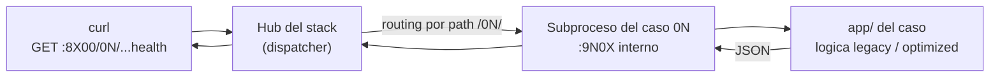

# 🛠️ RUNBOOK

> Estado: activo
> Uso recomendado: operacion diaria, demos, diagnostico inicial y respuesta a fallas locales

## 🚪 Entradas soportadas

### Stacks completos (un comando por lenguaje)

| Escenario | Comando | Puertos |
| --- | --- | --- |
| PHP — portal + hub + DB + observabilidad | `docker compose -f compose.root.yml up -d --build` | `8080` portal · `8100` hub · `9091` Prometheus · `3001` Grafana |
| Python — dispatcher unificado | `docker compose -f compose.python.yml up -d --build` | `8200` hub |
| Node.js — dispatcher unificado | `docker compose -f compose.nodejs.yml up -d --build` | `8300` hub |
| Java 21 — dispatcher unificado | `docker compose -f compose.java.yml up -d --build` | `8400` hub |
| .NET 8 — dispatcher unificado | `docker compose -f compose.dotnet.yml up -d --build` | `8500` hub |
| Go 1.23 — dispatcher unificado | `docker compose -f compose.go.yml up -d --build` | `8600` hub |
| Rust 1.83 — dispatcher unificado | `docker compose -f compose.rust.yml up -d --build` | `8700` hub |
| Portal liviano | `docker compose -f compose.portal.yml up -d --build` | `8080` |

Los siete stacks pueden correr en paralelo sin colisión de puertos. **PHP/Python/Node/Java/.NET/Go/Rust sirven 18 casos cada uno desde `:8100`/`:8200`/`:8300`/`:8400`/`:8500`/`:8600`/`:8700`. 126 endpoints operativos detras de 7 hubs.**

### Flujo de una request (de curl al caso)



### Casos aislados (modo estudio individual)

Cada caso conserva su propio `compose.yml` para reproducir UN problema en aislamiento. Util cuando la gracia del caso **es** el aislamiento (caso `05` mide heap V8 / `tracemalloc` / `memory_get_usage()` sin contaminacion; caso `11` mide `event_loop_lag_ms` / contention sin requests concurrentes diluyendo la senal). Para los demas casos, los hubs son suficientes.

| Escenario | Comando recomendado |
| --- | --- |
| Caso 01 PHP | `docker compose -f cases/01-api-latency-under-load/php/compose.yml up -d --build` |
| Caso 01 Python | `docker compose -f cases/01-api-latency-under-load/python/compose.yml up -d --build` |
| Caso 02 PHP | `docker compose -f cases/02-n-plus-one-and-db-bottlenecks/php/compose.yml up -d --build` |
| Caso 02 Python | `docker compose -f cases/02-n-plus-one-and-db-bottlenecks/python/compose.yml up -d --build` |
| Caso 03 PHP | `docker compose -f cases/03-poor-observability-and-useless-logs/php/compose.yml up -d --build` |
| Caso 03 Node.js | `docker compose -f cases/03-poor-observability-and-useless-logs/node/compose.yml up -d --build` |
| Caso 03 Python | `docker compose -f cases/03-poor-observability-and-useless-logs/python/compose.yml up -d --build` |
| Caso 01 Node.js | `docker compose -f cases/01-api-latency-under-load/node/compose.yml up -d --build` |
| Caso 02 Node.js | `docker compose -f cases/02-n-plus-one-and-db-bottlenecks/node/compose.yml up -d --build` |
| Caso 04 Node.js | `docker compose -f cases/04-timeout-chain-and-retry-storms/node/compose.yml up -d --build` |
| Caso 05 Node.js | `docker compose -f cases/05-memory-pressure-and-resource-leaks/node/compose.yml up -d --build` |
| Caso 06 Node.js | `docker compose -f cases/06-broken-pipeline-and-fragile-delivery/node/compose.yml up -d --build` |
| Caso 07 Node.js | `docker compose -f cases/07-incremental-monolith-modernization/node/compose.yml up -d --build` |
| Caso 08 Node.js | `docker compose -f cases/08-critical-module-extraction-without-breaking-operations/node/compose.yml up -d --build` |
| Caso 09 Node.js | `docker compose -f cases/09-unstable-external-integration/node/compose.yml up -d --build` |
| Caso 10 Node.js | `docker compose -f cases/10-expensive-architecture-for-simple-needs/node/compose.yml up -d --build` |
| Caso 11 Node.js | `docker compose -f cases/11-heavy-reporting-blocks-operations/node/compose.yml up -d --build` |
| Caso 12 Node.js | `docker compose -f cases/12-single-point-of-knowledge-and-operational-risk/node/compose.yml up -d --build` |
| Caso 01 Java 21 | `docker compose -f cases/01-api-latency-under-load/java/compose.yml up -d --build` |
| Caso 02 Java 21 | `docker compose -f cases/02-n-plus-one-and-db-bottlenecks/java/compose.yml up -d --build` |
| Caso 03 Java 21 | `docker compose -f cases/03-poor-observability-and-useless-logs/java/compose.yml up -d --build` |
| Caso 04 Java 21 | `docker compose -f cases/04-timeout-chain-and-retry-storms/java/compose.yml up -d --build` |
| Caso 05 Java 21 | `docker compose -f cases/05-memory-pressure-and-resource-leaks/java/compose.yml up -d --build` |
| Caso 06 Java 21 | `docker compose -f cases/06-broken-pipeline-and-fragile-delivery/java/compose.yml up -d --build` |
| Caso 07 Java 21 | `docker compose -f cases/07-incremental-monolith-modernization/java/compose.yml up -d --build` |
| Caso 08 Java 21 | `docker compose -f cases/08-critical-module-extraction-without-breaking-operations/java/compose.yml up -d --build` |
| Caso 09 Java 21 | `docker compose -f cases/09-unstable-external-integration/java/compose.yml up -d --build` |
| Caso 10 Java 21 | `docker compose -f cases/10-expensive-architecture-for-simple-needs/java/compose.yml up -d --build` |
| Caso 11 Java 21 | `docker compose -f cases/11-heavy-reporting-blocks-operations/java/compose.yml up -d --build` |
| Caso 12 Java 21 | `docker compose -f cases/12-single-point-of-knowledge-and-operational-risk/java/compose.yml up -d --build` |
| Caso 01 .NET 8 | `docker compose -f cases/01-api-latency-under-load/dotnet/compose.yml up -d --build` |
| Caso 02 .NET 8 | `docker compose -f cases/02-n-plus-one-and-db-bottlenecks/dotnet/compose.yml up -d --build` |
| Caso 03 .NET 8 | `docker compose -f cases/03-poor-observability-and-useless-logs/dotnet/compose.yml up -d --build` |
| Caso 04 .NET 8 | `docker compose -f cases/04-timeout-chain-and-retry-storms/dotnet/compose.yml up -d --build` |
| Caso 05 .NET 8 | `docker compose -f cases/05-memory-pressure-and-resource-leaks/dotnet/compose.yml up -d --build` |
| Caso 06 .NET 8 | `docker compose -f cases/06-broken-pipeline-and-fragile-delivery/dotnet/compose.yml up -d --build` |
| Caso 07 .NET 8 | `docker compose -f cases/07-incremental-monolith-modernization/dotnet/compose.yml up -d --build` |
| Caso 08 .NET 8 | `docker compose -f cases/08-critical-module-extraction-without-breaking-operations/dotnet/compose.yml up -d --build` |
| Caso 09 .NET 8 | `docker compose -f cases/09-unstable-external-integration/dotnet/compose.yml up -d --build` |
| Caso 10 .NET 8 | `docker compose -f cases/10-expensive-architecture-for-simple-needs/dotnet/compose.yml up -d --build` |
| Caso 11 .NET 8 | `docker compose -f cases/11-heavy-reporting-blocks-operations/dotnet/compose.yml up -d --build` |
| Caso 12 .NET 8 | `docker compose -f cases/12-single-point-of-knowledge-and-operational-risk/dotnet/compose.yml up -d --build` |

## ▶️ Arranque recomendado

1. Levanta `compose.root.yml` si quieres ver hoy todo el laboratorio PHP desde una sola entrada.
2. Levanta un caso operativo especifico segun el problema que quieres evaluar.
3. Verifica `docker compose ps`.
4. Valida la URL esperada del servicio.

## 🔎 Diagnostico rapido

### PHP (compose.root.yml)

| Componente | URL | Senal esperada |
| --- | --- | --- |
| Portal | `http://localhost:8080` | Landing local disponible |
| PHP hub — índice | `http://localhost:8100/` | Lista de casos JSON |
| Caso 01 PHP | `http://localhost:8100/01/health` | Respuesta saludable |
| Caso 02 PHP | `http://localhost:8100/02/health` | Respuesta saludable |
| Casos 03–12 PHP | `http://localhost:8100/03/health` … `http://localhost:8100/12/health` | Respuesta saludable |
| Prometheus | `http://localhost:9091` | Targets visibles |
| Grafana | `http://localhost:3001` | Login accesible |

### Python (compose.python.yml)

| Componente | URL | Senal esperada |
| --- | --- | --- |
| Python hub — índice | `http://localhost:8200/` | Lista de casos JSON |
| Caso 01 Python | `http://localhost:8200/01/health` | Respuesta saludable |
| Caso 02 Python | `http://localhost:8200/02/health` | Respuesta saludable |
| Casos 03–12 Python | `http://localhost:8200/03/health` … `http://localhost:8200/12/health` | Respuesta saludable |

### Node.js (compose.nodejs.yml)

| Componente | URL | Senal esperada |
| --- | --- | --- |
| Node.js hub — índice | `http://localhost:8300/` | Lista de casos JSON |
| Caso 01 Node.js | `http://localhost:8300/01/health` | Respuesta saludable |
| Caso 02 Node.js | `http://localhost:8300/02/health` | Respuesta saludable |
| Casos 03–12 Node.js | `http://localhost:8300/03/health` … `http://localhost:8300/12/health` | Respuesta saludable |

### Java 21 (compose.java.yml)

| Componente | URL | Senal esperada |
| --- | --- | --- |
| Java hub — índice | `http://localhost:8400/` | Lista de los 18 casos JSON |
| Caso 01 Java | `http://localhost:8400/01/health` | Respuesta saludable |
| Caso 02 Java | `http://localhost:8400/02/health` | Respuesta saludable |
| Casos 03–12 Java | `http://localhost:8400/03/health` … `http://localhost:8400/12/health` | Respuesta saludable |

### .NET 8 (compose.dotnet.yml)

| Componente | URL | Senal esperada |
| --- | --- | --- |
| .NET hub — índice | `http://localhost:8500/` | Lista de los 18 casos JSON |
| Caso 01 .NET | `http://localhost:8500/01/health` | Respuesta saludable |
| Caso 02 .NET | `http://localhost:8500/02/health` | Respuesta saludable |
| Casos 03–12 .NET | `http://localhost:8500/03/health` … `http://localhost:8500/12/health` | Respuesta saludable |
| Go hub — índice | `http://localhost:8600/` | Lista de los 18 casos JSON |
| Casos 01–12 Go | `http://localhost:8600/01/health` … `http://localhost:8600/12/health` | Respuesta saludable |
| Rust hub — índice | `http://localhost:8700/` | Lista de los 18 casos JSON |
| Casos 01–12 Rust | `http://localhost:8700/01/health` … `http://localhost:8700/12/health` | Respuesta saludable |

### Casos aislados (modo estudio — solo cuando el aislamiento aporta)

| Componente | URL | Cuando usarlo |
| --- | --- | --- |
| Caso 05 Node.js aislado | `http://localhost:825/health` | Medir `process.memoryUsage()` heap V8 sin contaminacion de otros workloads |
| Caso 11 Node.js aislado | `http://localhost:8211/health` | Medir `event_loop_lag_ms` sin requests concurrentes diluyendo la senal |
| Caso 05 Java aislado | `http://localhost:845/health` | Medir `Runtime.totalMemory()` y eviccion del `LinkedHashMap` LRU sin contaminacion |
| Caso 05 .NET aislado | `http://localhost:855/health` | Medir `Process.WorkingSet64` y eviccion del LRU `Dictionary+LinkedList` sin contaminacion |
| Caso 11 .NET aislado | `http://localhost:8511/health` | Medir `ThreadPool.GetAvailableWorkerThreads` sin requests concurrentes diluyendo la senal |
| Otros casos aislados | `http://localhost:821-829`, `8210-8212` (Node) · `841-849`, `8410-8412` (Java) · `851-859`, `8510-8512` (.NET) | Disponibles, pero los hubs (`8100`/`8200`/`8300`/`8400`/`8500`) ya los aislan por path |

## 🧰 Comandos utiles de operacion

```bash
# Ver estado de todo el stack PHP
docker compose -f compose.root.yml ps
docker compose -f compose.root.yml logs --tail=100

# Ver estado de todo el stack Python
docker compose -f compose.python.yml ps
docker compose -f compose.python.yml logs --tail=100

# Ver logs de un caso Python especifico
docker compose -f compose.python.yml logs -f case03-python

# Ver estado del stack Node.js
docker compose -f compose.nodejs.yml ps
docker compose -f compose.nodejs.yml logs --tail=100

# Ver estado del stack Java
docker compose -f compose.java.yml ps
docker compose -f compose.java.yml logs --tail=100

# Ver estado del stack .NET
docker compose -f compose.dotnet.yml ps
docker compose -f compose.dotnet.yml logs --tail=100

# Portal
docker compose -f compose.portal.yml ps
docker compose -f compose.portal.yml logs --tail=100

# Casos aislados (ejemplos)
docker compose -f cases/01-api-latency-under-load/php/compose.yml ps
docker compose -f cases/01-api-latency-under-load/php/compose.yml logs --tail=100

docker compose -f cases/03-poor-observability-and-useless-logs/node/compose.yml ps
docker compose -f cases/03-poor-observability-and-useless-logs/node/compose.yml logs --tail=100
```

## 🚨 Respuesta a incidencias comunes

| Problema | Respuesta operativa |
| --- | --- |
| Puerto ocupado | Libera el puerto o cambia el mapeo antes de levantar el caso |
| Contenedor `db` tarda en quedar sano | Espera el healthcheck o revisa `logs` antes de reiniciar |
| La API responde lento en caso 01 | Confirma si el worker y la carga estan activos; el caso esta pensado para mostrar contencion real |
| `make` falla en Windows | Usa `docker compose` directo o ejecuta el Makefile desde Git Bash o WSL |
| Telemetria o datos quedan "sucios" despues de muchas pruebas | Baja el caso y vuelve a levantarlo; si necesitas reinicio completo, recrea el stack y sus volumenes conscientemente |

## 🧯 Apagado ordenado

```bash
# Bajar stack completo PHP
docker compose -f compose.root.yml down

# Bajar stack completo Python
docker compose -f compose.python.yml down

# Bajar stack completo Node.js
docker compose -f compose.nodejs.yml down

# Bajar stack completo Java
docker compose -f compose.java.yml down

# Bajar stack completo .NET
docker compose -f compose.dotnet.yml down

# Bajar portal
docker compose -f compose.portal.yml down

# Bajar casos aislados (si los levantaste individualmente)
docker compose -f cases/01-api-latency-under-load/php/compose.yml down
docker compose -f cases/03-poor-observability-and-useless-logs/node/compose.yml down
```

## 🧭 Cuando usar este runbook

- Antes de una demo o revision tecnica.
- Cuando un caso operativo no levanta como esperas.
- Cuando necesitas validar si el problema esta en Docker, en el caso o en el host.

## 📚 Documentos relacionados

- [INSTALL.md](INSTALL.md)
- [SUPPORT.md](SUPPORT.md)
- [docs/docker-strategy.md](docs/docker-strategy.md)
- [docs/usage-and-scope.md](docs/usage-and-scope.md)
