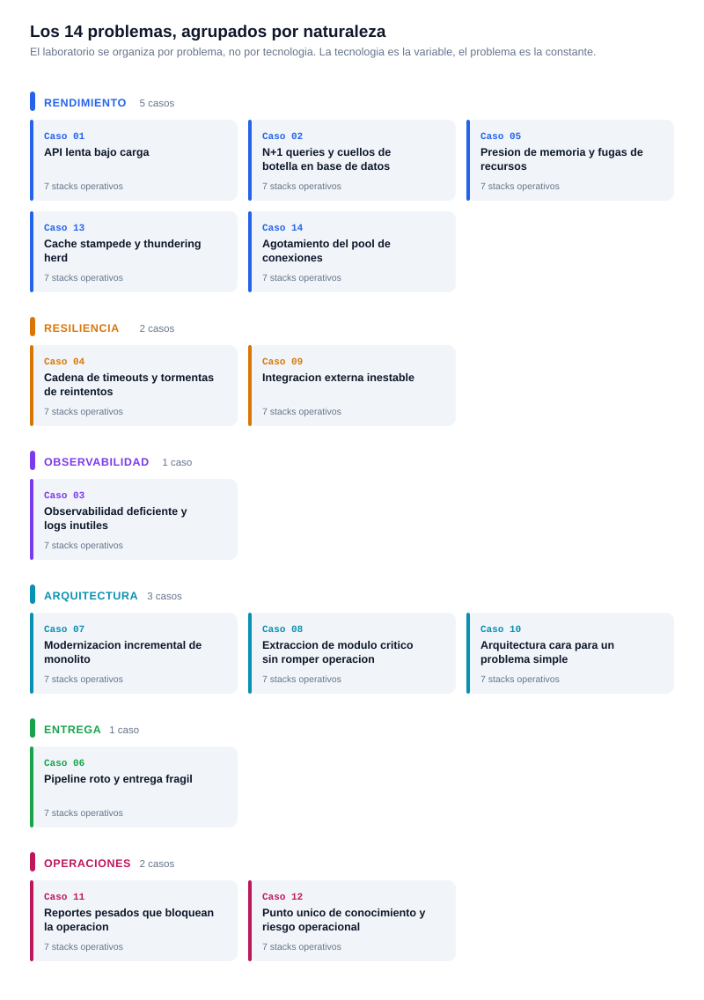

# 🌱 Guía para principiantes

> Para quien está empezando a programar y quiere recorrer este laboratorio sin perderse.

> 🧭 **¿No sos del mundo del desarrollo?** Empezá por **[¿Qué es esto? — explicación en lenguaje simple](QUE-ES-ESTO.md)**. Está escrito sin jerga y no supone ningún conocimiento previo.

---

## 1️⃣ La ruta en 6 pasos

| # | Paso | Documento |
|---|---|---|
| 1 | Entender la idea general del laboratorio | [README.md](../README.md) |
| 2 | Ver qué problema profesional resuelve | [positioning-and-objective.md](positioning-and-objective.md) |
| 3 | Identificar los casos y su estado real | [case-catalog.md](case-catalog.md) |
| 4 | Levantar **un** caso con Docker | [INSTALL.md](../INSTALL.md) |
| 5 | Destrabar lo que no arranque | [RUNBOOK.md](../RUNBOOK.md) |
| 6 | Comparar el mismo caso en otro lenguaje | `cases/NN-*/comparison.md` |

> 💡 Los **12 casos están operativos en los 7 stacks**: PHP, Python, Node.js, Java, .NET, Go y Rust. Podés recorrer cualquier caso en cualquiera de ellos.

---

## 🧠 Términos clave de este repositorio

| Término | Significado acá |
|---|---|
| **Problem-driven** | El problema manda; el stack se elige para resolverlo, no al revés |
| **Operativo** | Caso implementado con evidencia real y Docker funcional |
| **Legacy vs optimized** | Las dos variantes de cada caso: la que tiene el problema y la que lo resuelve. Están vivas al mismo tiempo para poder compararlas |
| **Hub** | Un contenedor que sirve los 12 casos de un lenguaje detrás de un puerto (`:8100` PHP, `:8300` Node, …) |
| **Modo aislado** | Levantar un solo caso en su propio contenedor, útil cuando la medición necesita el runtime sin ruido |
| **Primitiva** | La herramienta que el lenguaje trae de fábrica para resolver algo (un canal en Go, un `Semaphore` en Java) |
| **Comparativa** | El `comparison.md` de cada caso: los 7 stacks lado a lado y un veredicto razonado |

---

## 🚪 Por dónde empezar



| Caso | Por qué empezar ahí |
|---|---|
| [02 · N+1 en base de datos](../cases/02-n-plus-one-and-db-bottlenecks/README.md) | **El más fácil de entender.** El problema se ve contando consultas: 101 en vez de 2 |
| [01 · API lenta bajo carga](../cases/01-api-latency-under-load/README.md) | El más completo: base de datos, worker, métricas y dashboards en Grafana |
| [03 · Observabilidad deficiente](../cases/03-poor-observability-and-useless-logs/README.md) | Muestra rápido por qué unos logs sin contexto no sirven para nada |
| [04 · Timeouts y reintentos](../cases/04-timeout-chain-and-retry-storms/README.md) | Para entender circuit breaker y degradación controlada |
| [06 · Pipeline frágil](../cases/06-broken-pipeline-and-fragile-delivery/README.md) | Hace visible por qué preflight y rollback importan |

---

## 🔍 Cómo leer un caso

Cada caso tiene siempre la misma estructura. Leerlos en este orden hace que el código se entienda solo:

```text
cases/NN-nombre-del-caso/
├── README.md          ← empezá acá: el problema en contexto
├── comparison.md      ← los 7 stacks lado a lado + veredicto
├── docs/
│   ├── context.md          ← la situación
│   ├── symptoms.md         ← qué se ve desde afuera
│   ├── diagnosis.md        ← cómo se buscó la causa
│   ├── root-causes.md      ← qué lo provoca de verdad
│   ├── solution-options.md ← los caminos posibles
│   ├── trade-offs.md       ← qué se gana y qué se pierde
│   ├── business-value.md   ← por qué le importa a la empresa
│   └── postmortem.md       ← qué se aprendió
├── php/  python/  node/  java/  dotnet/  go/  rust/
└── shared/
```

> 📌 **La regla de oro:** leé `README.md` y `docs/` **antes** de abrir el código. El repositorio está construido para que el código sea la conclusión de un razonamiento, no el punto de partida.

---

## 🧪 Tu primer experimento

Levantá el caso 02 en Go y mirá el problema con tus propios ojos:

```bash
docker compose -f compose.go.yml up -d --build
```

```bash
curl -s "localhost:8600/02/report-legacy?limit=20"
```

Fijate en el campo `db_hits`: va a ser `1 + N`. Una consulta para traer la lista, y una más **por cada fila**.

```bash
curl -s "localhost:8600/02/report-optimized?limit=20"
```

Ahora `db_hits` es un número chico y constante, sin importar cuántas filas pidas. Ese salto —de crecer con los datos a no crecer— es el caso 02 entero.

Cuando termines:

```bash
docker compose -f compose.go.yml down
```

---

## 🌍 Y después, el mismo caso en otro lenguaje

Es la parte más formativa del laboratorio. El mismo experimento en Rust:

```bash
docker compose -f compose.rust.yml up -d --build
```

Mismo problema, mismo arreglo, primitiva distinta. La comparativa [`cases/02-*/comparison.md`](../cases/02-n-plus-one-and-db-bottlenecks/comparison.md) explica por qué Rust queda primero en ese caso concreto: `collect::<Result<Vec<_>>>()` hace **imposible** ignorar un fallo a mitad del recorrido, algo que en los otros seis stacks depende de que el programador se acuerde.

Para entender qué es cada lenguaje y en qué es bueno, están los [perfiles de lenguaje](languages/README.md).

---

## 💡 Cuatro consejos que ahorran tiempo

1. **Un caso por vez.** No levantes los siete stacks juntos "para ver si funciona". El ruido tapa lo que querés observar.
2. **Comparar siempre legacy contra optimized.** Un número solo no dice nada; la diferencia entre los dos, sí.
3. **Descartar el arranque.** En Java y .NET las primeras peticiones son más lentas porque el runtime todavía se está calentando. Tirá tráfico un rato antes de medir.
4. **Leer el veredicto de la comparativa al final, no al principio.** Si lo leés primero, ya no vas a sacar tus propias conclusiones.

---

## 📚 Adónde ir después

| Documento | Para qué |
|---|---|
| [QUE-ES-ESTO.md](QUE-ES-ESTO.md) | La versión sin jerga, para compartir con alguien no técnico |
| [languages/](languages/README.md) | Qué es cada lenguaje, sus primitivas y sus límites |
| [case-methodology.md](case-methodology.md) | Cómo se construye un caso antes de escribir código |
| [docker-strategy.md](docker-strategy.md) | Por qué Docker es el modelo operativo del laboratorio |
| [executive-summary.md](executive-summary.md) | Los 12 casos en una página |
