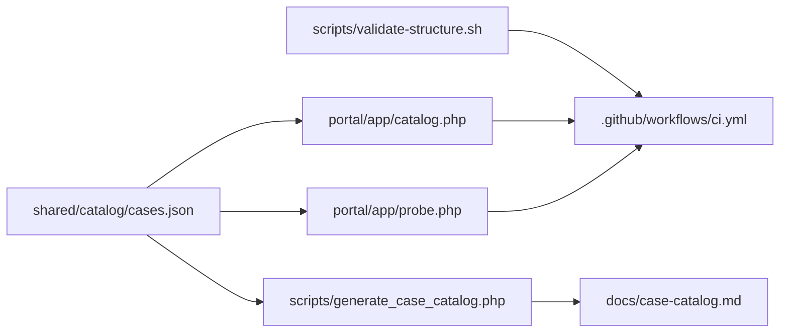

# 🏛️ Arquitectura del repositorio

> Vista estructural del laboratorio, con foco en el estado actual del sistema y no solo en la forma del arbol.

## 📐 Estructura por niveles

```text
problem-driven-systems-lab/
|- README.md
|- ARCHITECTURE.md
|- RECRUITER.md
|- INSTALL.md
|- RUNBOOK.md
|- SECURITY.md
|- SUPPORT.md
|- CONTRIBUTING.md
|- CHANGELOG.md
|- ROADMAP.md
|- compose.root.yml       ← PHP: 12 casos + portal + DB + observabilidad
|- compose.python.yml     ← Python: 12 casos, stdlib pura
|- compose.portal.yml     ← portal liviano solamente
|- docker/
|- .github/workflows/ci.yml
|- portal/
|- docs/
|- cases/
|- shared/
|  `- catalog/cases.json
`- scripts/
   `- generate_case_catalog.php
```

## 🧱 Capas principales

### 1. Capa editorial y operativa

La raiz contiene documentos para lectura ejecutiva, tecnica y operacional. Esta capa explica el producto antes de entrar a cualquier caso.

### 2. Capa de metadatos

`shared/catalog/cases.json` es la fuente de verdad del catalogo.

- el portal local lo consume;
- `scripts/generate_case_catalog.php` genera `docs/case-catalog.md`;
- la CI verifica que no exista drift documental.

### 3. Capa de portal y stacks raíz

Cada lenguaje operativo tiene su propio compose en la raíz — un comando levanta los 12 casos de ese lenguaje:

- `compose.root.yml` — PHP: portal + 12 casos + PostgreSQL (casos 01–02) + Prometheus + Grafana
- `compose.python.yml` — Python: 12 casos, stdlib pura, sin dependencias externas
- `compose.portal.yml` — portal liviano solamente

Los stacks PHP y Python pueden correr en paralelo sin colisión de puertos (PHP: 811–8112, Python: 831–8312). Cuando se incorporen lenguajes adicionales (Node.js, Java, .NET), seguirán el mismo patrón con su bloque de puertos propio.

La capa visual sigue viviendo en `portal/`, con:

- `index.html` como portada principal para personas tecnicas y no tecnicas;
- `catalog.php` como endpoint de metadatos para la UI;
- `probe.php` como verificador server-side de health checks;
- `index.php` como redireccion de compatibilidad.

### 4. Capa de casos

Cada carpeta en `cases/` representa un problema real. La unidad central del laboratorio es el caso, no el lenguaje.

### 5. Capa de stacks

Cada caso contiene `php`, `node`, `python`, `java` y `dotnet` con Docker aislado. La madurez real de cada stack depende de su implementacion, no solo de la existencia de la carpeta.

## 🔁 Flujo de sincronizacion actual



## 🐳 Modelo de ejecucion

| Pieza | Rol |
| --- | --- |
| `compose.root.yml` | portal + laboratorio PHP completo (12 casos, DB, Prometheus, Grafana) |
| `compose.python.yml` | laboratorio Python completo (12 casos, stdlib pura, sin dependencias externas) |
| `compose.portal.yml` | portal liviano |
| `cases/<caso>/<stack>/compose.yml` | escenario concreto y aislado (desarrollo o revision individual) |
| `cases/<caso>/compose.compare.yml` | comparacion entre stacks del mismo caso |

La familia PHP reutiliza un runtime comun en `docker/php/Dockerfile`. La familia Python usa `python:3.12-alpine` directamente en cada caso. Cada caso mantiene su propio `compose.yml` interno independientemente del compose raiz del lenguaje.

## ✅ Estado operativo real

| Caso | php | python | node | java | dotnet |
| --- | --- | --- | --- | --- | --- |
| `01` | ✅ OPERATIVO | ✅ OPERATIVO | scaffold | scaffold | scaffold |
| `02` | ✅ OPERATIVO | ✅ OPERATIVO | scaffold | scaffold | scaffold |
| `03` | ✅ OPERATIVO | ✅ OPERATIVO | ✅ OPERATIVO | scaffold | scaffold |
| `04` | ✅ OPERATIVO | ✅ OPERATIVO | scaffold | scaffold | scaffold |
| `05` | ✅ OPERATIVO | ✅ OPERATIVO | scaffold | scaffold | scaffold |
| `06` | ✅ OPERATIVO | ✅ OPERATIVO | scaffold | scaffold | scaffold |
| `07` | ✅ OPERATIVO | ✅ OPERATIVO | scaffold | scaffold | scaffold |
| `08` | ✅ OPERATIVO | ✅ OPERATIVO | scaffold | scaffold | scaffold |
| `09` | ✅ OPERATIVO | ✅ OPERATIVO | scaffold | scaffold | scaffold |
| `10` | ✅ OPERATIVO | ✅ OPERATIVO | scaffold | scaffold | scaffold |
| `11` | ✅ OPERATIVO | ✅ OPERATIVO | scaffold | scaffold | scaffold |
| `12` | ✅ OPERATIVO | ✅ OPERATIVO | scaffold | scaffold | scaffold |

**OPERATIVO** = lógica real, Docker funcional, evidencia observable.
**scaffold** = estructura y documentación lista, sin implementación funcional todavía.

## 🧭 Regla principal

La arquitectura responde a esta pregunta:

> ¿Como resolver y estudiar este problema con evidencia reproducible?

No responde a:

> ¿Como ordenar lenguajes por gusto o llenar carpetas sin profundidad?
