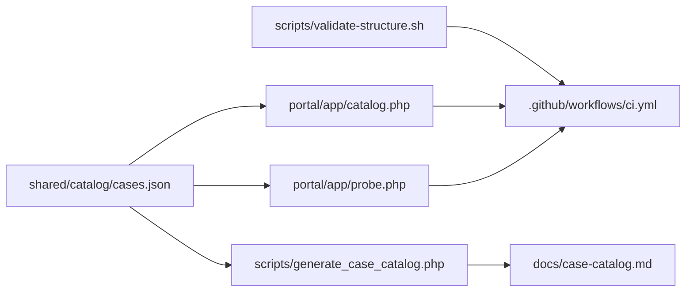

# 🏛️ Arquitectura del repositorio

> Vista estructural del laboratorio, con foco en el estado actual del sistema y no solo en la forma del arbol.

## 📐 Estructura por niveles

```text
problem-driven-systems-lab/
|- README.md
|- ARCHITECTURE.md
|- RECRUITER.md
|- INSTALL.md
|- RUNBOOK.md
|- SECURITY.md
|- SUPPORT.md
|- CONTRIBUTING.md
|- CHANGELOG.md
|- ROADMAP.md
|- compose.root.yml
|- compose.portal.yml
|- docker/
|- .github/workflows/ci.yml
|- portal/
|- docs/
|- cases/
|- shared/
|  `- catalog/cases.json
`- scripts/
   `- generate_case_catalog.php
```

## 🧱 Capas principales

### 1. Capa editorial y operativa

La raiz contiene documentos para lectura ejecutiva, tecnica y operacional. Esta capa explica el producto antes de entrar a cualquier caso.

### 2. Capa de metadatos

`shared/catalog/cases.json` es la fuente de verdad del catalogo.

- el portal local lo consume;
- `scripts/generate_case_catalog.php` genera `docs/case-catalog.md`;
- la CI verifica que no exista drift documental.

### 3. Capa de portal

`compose.root.yml` levanta hoy el portal y los 12 casos PHP operativos en una sola entrada.

`compose.portal.yml` conserva el modo ligero solo para portal.

La capa visual sigue viviendo en `portal/`, con:

- `index.html` como portada principal para personas tecnicas y no tecnicas;
- `catalog.php` como endpoint de metadatos para la UI;
- `probe.php` como verificador server-side de health checks;
- `index.php` como redireccion de compatibilidad.

### 4. Capa de casos

Cada carpeta en `cases/` representa un problema real. La unidad central del laboratorio es el caso, no el lenguaje.

### 5. Capa de stacks

Cada caso contiene `php`, `node`, `python`, `java` y `dotnet` con Docker aislado. La madurez real de cada stack depende de su implementacion, no solo de la existencia de la carpeta.

## 🔁 Flujo de sincronizacion actual



## 🐳 Modelo de ejecucion

| Pieza | Rol |
| --- | --- |
| `compose.root.yml` | portal + laboratorio PHP completo |
| `compose.portal.yml` | portal liviano |
| `cases/<caso>/<stack>/compose.yml` | escenario concreto y aislado |
| `cases/<caso>/compose.compare.yml` | comparacion entre stacks del mismo caso |

La familia PHP reutiliza ahora un runtime comun en `docker/php/Dockerfile`, mientras cada caso mantiene su `compose.yml` y sus dependencias particulares.

## ✅ Estado operativo real

| Caso | Stacks operativos actuales |
| --- | --- |
| `01` | `php` |
| `02` | `php` |
| `03` | `php`, `node`, `python` |
| `04` | `php` |
| `05` | `php` |
| `06` | `php` |
| `07` | `php` |
| `08` | `php` |
| `09` | `php` |
| `10` | `php` |
| `11` | `php` |
| `12` | `php` |

## 🧭 Regla principal

La arquitectura responde a esta pregunta:

> ¿Como resolver y estudiar este problema con evidencia reproducible?

No responde a:

> ¿Como ordenar lenguajes por gusto o llenar carpetas sin profundidad?
