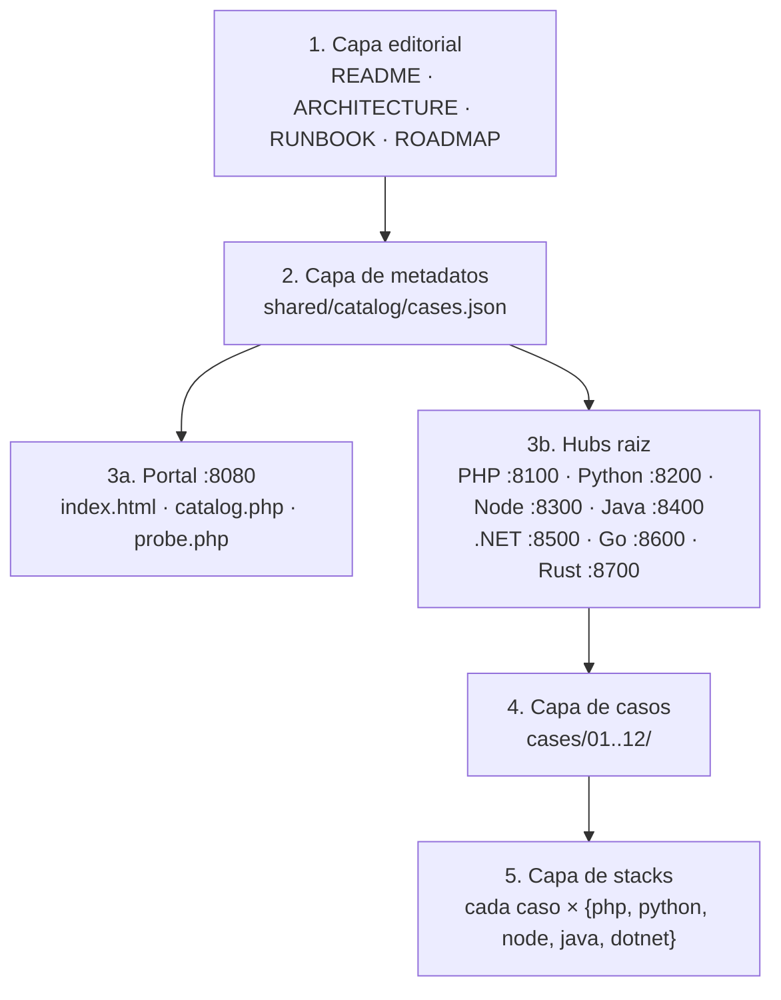

# 🏛️ Arquitectura del repositorio

> Vista estructural del laboratorio, con foco en el estado actual del sistema y no solo en la forma del arbol.

## 📐 Estructura por niveles

```text
problem-driven-systems-lab/
|- README.md
|- ARCHITECTURE.md
|- RECRUITER.md
|- INSTALL.md
|- RUNBOOK.md
|- SECURITY.md
|- SUPPORT.md
|- CONTRIBUTING.md
|- CHANGELOG.md
|- ROADMAP.md
|- compose.root.yml       ← PHP: 16 casos + portal + DB + observabilidad
|- compose.python.yml     ← Python: 16 casos, stdlib pura
|- compose.portal.yml     ← portal liviano solamente
|- docker/
|- .github/workflows/ci.yml
|- portal/
|- docs/
|- cases/
|- shared/
|  `- catalog/cases.json
`- scripts/
   `- generate_case_catalog.php
```

### Vista de capas (Mermaid)


```mermaid
flowchart TB
    editorial["1. Capa editorial<br/>README · ARCHITECTURE · RUNBOOK · ROADMAP"]
    catalog["2. Capa de metadatos<br/>shared/catalog/cases.json"]
    portal_layer["3a. Portal :8080<br/>index.html · catalog.php · probe.php"]
    hubs["3b. Hubs raiz<br/>PHP :8100 · Python :8200 · Node :8300 · Java :8400<br/>.NET :8500 · Go :8600 · Rust :8700"]
    cases_layer["4. Capa de casos<br/>cases/01..12/"]
    stacks_layer["5. Capa de stacks<br/>cada caso × {php, python, node, java, dotnet}"]

    editorial --> catalog
    catalog --> portal_layer
    catalog --> hubs
    hubs --> cases_layer
    cases_layer --> stacks_layer
```

## 🧱 Capas principales

### 1. Capa editorial y operativa

La raiz contiene documentos para lectura ejecutiva, tecnica y operacional. Esta capa explica el producto antes de entrar a cualquier caso.

### 2. Capa de metadatos

`shared/catalog/cases.json` es la fuente de verdad del catalogo.

- el portal local lo consume;
- `scripts/generate_case_catalog.php` genera `docs/case-catalog.md`;
- la CI verifica que no exista drift documental.

### 3. Capa de portal y stacks raíz

Cada lenguaje operativo tiene su propio compose en la raíz — un comando levanta los 16 casos de ese lenguaje:

- `compose.root.yml` — PHP: portal (`8080`) + dispatcher PHP `php-lab` (`8100`, 16 casos internos en `:9001-:9016`) + PostgreSQL (casos 01–02) + worker case01 + Prometheus (`9091`) + Grafana (`3001`)
- `compose.python.yml` — Python: dispatcher único con 16 casos internos (`8200`), stdlib pura, sin dependencias externas
- `compose.nodejs.yml` — Node.js 22: dispatcher único con 16 casos internos (`8300`), stdlib pura (incluye `node:sqlite` built-in usado en caso 02), sin dependencias externas
- `compose.java.yml` — Java 21: dispatcher único con 16 casos internos (`8400`), JDK built-in (`HttpServer`, `HttpClient`), sin Maven
- `compose.dotnet.yml` — .NET 8: dispatcher único con 16 casos internos (`8500`), BCL built-in (`HttpListener`, `System.Text.Json`)
- `compose.go.yml` — Go 1.23: dispatcher único con 16 casos internos (`8600`), stdlib (`net/http`, `httputil.ReverseProxy`)
- `compose.rust.yml` — Rust 1.83: dispatcher único con 16 casos internos (`8700`); `std` no trae HTTP, la capa va sobre `TcpListener`
- `compose.portal.yml` — portal liviano solamente (`8080`)

Los siete stacks operativos pueden correr en paralelo sin colisión de puertos.

La capa visual sigue viviendo en `portal/`, con:

- `index.html` como portada principal para personas tecnicas y no tecnicas;
- `catalog.php` como endpoint de metadatos para la UI;
- `probe.php` como verificador server-side de health checks;
- `index.php` como redireccion de compatibilidad.

### 4. Capa de casos

Cada carpeta en `cases/` representa un problema real. La unidad central del laboratorio es el caso, no el lenguaje.

### 5. Capa de stacks

Cada caso contiene `php`, `node`, `python`, `java` y `dotnet` con Docker aislado. La madurez real de cada stack depende de su implementacion, no solo de la existencia de la carpeta.

## 🔁 Flujo de sincronizacion actual

```
shared/catalog/cases.json
  ├──▶ portal/app/catalog.php    (payload JSON para la UI)
  ├──▶ portal/app/probe.php      (health checks server-side)
  └──▶ scripts/generate_case_catalog.php
              └──▶ docs/case-catalog.md

scripts/validate-structure.sh ──▶ .github/workflows/ci.yml ◀── catalog.php
                                                            ◀── probe.php
```

## 🐳 Modelo de ejecucion

| Pieza | Rol |
| --- | --- |
| `compose.root.yml` | portal (`8080`) + `php-lab` dispatcher (`8100`, 16 casos PHP como subprocesos internos) + DB caso 01-02 + worker + Prometheus + Grafana |
| `compose.python.yml` | dispatcher Python (`8200`) con los 16 casos internos, stdlib pura, sin dependencias externas |
| `compose.nodejs.yml` | dispatcher Node.js (`8300`) con los 16 casos internos, stdlib pura |
| `compose.java.yml` | dispatcher Java (`8400`) con los 16 casos internos, JDK built-in (sin Maven) |
| `compose.dotnet.yml` | dispatcher .NET 8 (`8500`) con los 16 casos internos, BCL built-in |
| `compose.go.yml` | dispatcher Go 1.23 (`8600`) con los 16 casos internos, stdlib |
| `compose.rust.yml` | dispatcher Rust 1.83 (`8700`) con los 16 casos internos, capa HTTP propia |
| `compose.portal.yml` | portal liviano |
| `cases/<caso>/<stack>/compose.yml` | escenario concreto y aislado (desarrollo o revision individual) |
| `cases/<caso>/compose.compare.yml` | comparacion entre stacks del mismo caso |

La familia PHP reutiliza un runtime comun en `docker/php/Dockerfile`. La familia Python usa `python:3.12-alpine` directamente en cada caso. Cada caso mantiene su propio `compose.yml` interno independientemente del compose raiz del lenguaje.

## ✅ Estado operativo real

| Caso | php | python | node | java | dotnet |
| --- | --- | --- | --- | --- | --- |
| `01` | ✅ OPERATIVO | ✅ OPERATIVO | ✅ OPERATIVO | ✅ OPERATIVO | ✅ OPERATIVO |
| `02` | ✅ OPERATIVO | ✅ OPERATIVO | ✅ OPERATIVO | ✅ OPERATIVO | ✅ OPERATIVO |
| `03` | ✅ OPERATIVO | ✅ OPERATIVO | ✅ OPERATIVO | ✅ OPERATIVO | ✅ OPERATIVO |
| `04` | ✅ OPERATIVO | ✅ OPERATIVO | ✅ OPERATIVO | ✅ OPERATIVO | ✅ OPERATIVO |
| `05` | ✅ OPERATIVO | ✅ OPERATIVO | ✅ OPERATIVO | ✅ OPERATIVO | ✅ OPERATIVO |
| `06` | ✅ OPERATIVO | ✅ OPERATIVO | ✅ OPERATIVO | ✅ OPERATIVO | ✅ OPERATIVO |
| `07` | ✅ OPERATIVO | ✅ OPERATIVO | ✅ OPERATIVO | ✅ OPERATIVO | ✅ OPERATIVO |
| `08` | ✅ OPERATIVO | ✅ OPERATIVO | ✅ OPERATIVO | ✅ OPERATIVO | ✅ OPERATIVO |
| `09` | ✅ OPERATIVO | ✅ OPERATIVO | ✅ OPERATIVO | ✅ OPERATIVO | ✅ OPERATIVO |
| `10` | ✅ OPERATIVO | ✅ OPERATIVO | ✅ OPERATIVO | ✅ OPERATIVO | ✅ OPERATIVO |
| `11` | ✅ OPERATIVO | ✅ OPERATIVO | ✅ OPERATIVO | ✅ OPERATIVO | ✅ OPERATIVO |
| `12` | ✅ OPERATIVO | ✅ OPERATIVO | ✅ OPERATIVO | ✅ OPERATIVO | ✅ OPERATIVO |

**OPERATIVO** = lógica real, Docker funcional, evidencia observable. Los 16 casos × 7 stacks (PHP / Python / Node.js 22 / Java 21 / .NET 8 / Go 1.23 / Rust 1.83) son todos `OPERATIVO` — paridad funcional completa con primitivas idiomáticas distintas por runtime.

## 🧭 Regla principal

La arquitectura responde a esta pregunta:

> ¿Como resolver y estudiar este problema con evidencia reproducible?

No responde a:

> ¿Como ordenar lenguajes por gusto o llenar carpetas sin profundidad?
