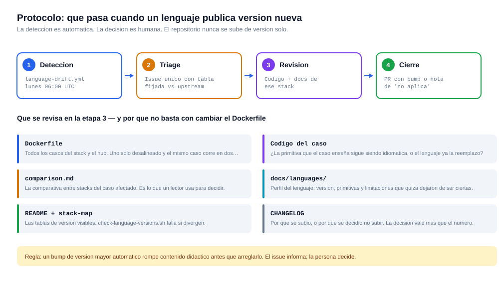

# 🔄 Protocolo de actualización por versión de lenguaje

> Qué hacer cuando uno de los siete lenguajes del laboratorio publica una versión nueva, o cuando la versión que usamos entra en fin de soporte.

---

## 🎯 El problema que este protocolo resuelve

Los 19 casos de este laboratorio no resuelven problemas con código genérico: los resuelven con **la primitiva idiomática de cada runtime**. Esa es toda la propuesta de valor del repositorio, y también su punto de caducidad.

Cuando un lenguaje evoluciona, la primitiva que un caso enseña puede quedar obsoleta y el caso pasa a enseñar **la forma vieja de hacer las cosas** sin que nadie lo note. El código sigue compilando. Los tests siguen en verde. Docker sigue levantando. Y la documentación sigue afirmando que esa es la manera correcta.

Cuatro ejemplos concretos que este protocolo existe para anticipar:

| Cambio upstream | Qué deja obsoleto | Caso afectado |
|---|---|---|
| **Java 21 → 25:** `ScopedValue` sale de preview | El `ThreadLocal` pasa de "alternativa razonable" a "lo que ya no se hace" | [03](../cases/03-poor-observability-and-useless-logs/java/README.md) |
| **Node 22 → 24:** `node:sqlite` deja de ser experimental | El flag `--experimental-sqlite` sobra, y la API pudo cambiar | [01](../cases/01-api-latency-under-load/node/README.md) · [02](../cases/02-n-plus-one-and-db-bottlenecks/node/README.md) |
| **Python 3.12 → 3.13+:** free-threading (PEP 703) | El GIL deja de ser un techo estructural y pasa a ser una opción de build | [11](../cases/11-heavy-reporting-blocks-operations/python/README.md) |
| **Rust:** si `std` incorpora timeout cancelable o semáforo | Las limitaciones documentadas **dejan de ser ciertas** | [04](../cases/04-timeout-chain-and-retry-storms/rust/README.md) · [09](../cases/09-unstable-external-integration/rust/README.md) |

Ninguno de esos cuatro es un cambio de `Dockerfile`. Los cuatro son cambios de **narrativa**.

---

## 🗺️ El flujo completo



---

## 1️⃣ Detección — automática, semanal

[`.github/workflows/language-drift.yml`](../.github/workflows/language-drift.yml) corre **todos los lunes a las 06:00 UTC** (y a demanda con `workflow_dispatch`).

Lo que hace [`scripts/language_drift.py`](../scripts/language_drift.py):

1. Lee la versión **real** desde los `Dockerfile` del repositorio — no desde una constante duplicada, que sería justo el drift que busca evitar.
2. Consulta el ciclo de vida publicado en [endoflife.date](https://endoflife.date) para los siete productos.
3. Emite dos señales distintas:

| Señal | Significado | Urgencia |
|---|---|---|
| 🔴 **EOL** | La versión que usamos ya no recibe soporte | Accionable ya |
| 🟡 **NUEVA** | Hay una versión mayor o menor más reciente | No urgente — pero puede haber vuelto obsoleta la primitiva |
| ⚠️ **Split** | El repositorio fija **dos versiones distintas** del mismo stack | Accionable: el mismo caso correría en dos runtimes |

En paralelo, [`scripts/check-language-versions.sh`](../scripts/check-language-versions.sh) corre **en cada PR** dentro de `ci.yml` y verifica lo determinista, sin red: que todos los `Dockerfile` de un stack fijen la misma imagen, y que la documentación declare esa misma versión.

> **Por qué están separados:** la detección de versiones nuevas necesita internet y no debe bloquear un merge. La coherencia interna no necesita internet y sí debe bloquearlo.

---

## 2️⃣ Triage — un solo issue, siempre el mismo

El workflow abre —o **actualiza**— un issue único titulado `Drift de versiones de lenguaje`, con una tabla de versión fijada contra última upstream y una columna de *qué podría quedar obsoleto*.

Es deliberadamente un issue y no un PR automático:

> ⚠️ **Regla del repositorio:** un bump de versión mayor automático rompe contenido didáctico antes que arreglarlo. El issue informa; **la decisión es humana y queda escrita.**

Al recibir el issue, clasificar cada fila en una de tres:

| Clasificación | Qué significa | Qué sigue |
|---|---|---|
| **No aplica** | Versión nueva sin impacto en las primitivas del lab | Anotar el razonamiento en el issue y seguir |
| **Revisar** | La primitiva de algún caso podría tener reemplazo idiomático | Ir al paso 3 |
| **Urgente** | EOL, CVE, o versión partida dentro del mismo stack | Ir al paso 3 con prioridad |

---

## 3️⃣ Revisión — la parte que no se puede automatizar

**El orden importa: primero se decide si la narrativa cambia, y recién después se toca el `Dockerfile`.** Al revés se termina con un repositorio que compila en la versión nueva y sigue enseñando lo de la versión vieja.

### ✅ Checklist de revisión

Para el stack afectado, en este orden:

- [ ] **1. Perfil del lenguaje** — [`docs/languages/<stack>.md`](languages/), sección `🔄 Ciclo de versiones`. Ahí está anotado, por stack, qué está en juego en el próximo salto. **Este es el punto de partida, no el `Dockerfile`.**
- [ ] **2. ¿La primitiva sigue siendo idiomática?** — Revisar la tabla `🧰 Primitivas que usa el laboratorio` del perfil, caso por caso. La pregunta no es *¿sigue funcionando?* sino *¿es todavía lo que escribiría hoy alguien que conoce el lenguaje?*
- [ ] **3. ¿Alguna limitación documentada dejó de ser cierta?** — Sección `🚧 Límites, problemas sin solución y desafíos`. Una limitación que se volvió falsa es peor que una primitiva vieja: es documentación que miente.
- [ ] **4. Código de los casos afectados** — `cases/NN-*/<stack>/`. Solo los casos que la revisión anterior marcó.
- [ ] **5. `comparison.md` de esos casos** — `cases/NN-*/comparison.md`. Es lo que un lector usa para decidir, e incluye la tabla de decisión, la primitiva central por stack y el **veredicto con ranking**. Si la primitiva cambió, el veredicto puede haber cambiado.
- [ ] **6. `Dockerfile`** — los 19 casos del stack **y** el hub. Uno solo desalineado y el mismo caso corre en dos runtimes según cómo se levante.
- [ ] **7. `shared/catalog/cases.json`** — bloque `languages`: `version`, `version_label`, `docker_image`. Es la fuente de verdad del portal y de los diagramas.
- [ ] **8. Tablas de versión visibles** — [`README.md`](../README.md) y [`docs/stack-map.md`](stack-map.md). `check-language-versions.sh` falla el PR si divergen del `Dockerfile`.
- [ ] **9. Diagramas** — `python scripts/generate_diagrams.py`. Los SVG de `docs/assets/` llevan la versión fijada de cada stack.
- [ ] **10. `CHANGELOG.md`** — **por qué** se subió, o **por qué se decidió no subir**. La decisión vale más que el número.

### 🧭 Cómo decidir si la narrativa cambia

Tres preguntas, en orden:

1. **¿El lenguaje incorporó algo que reemplaza a la primitiva del caso?**
   → Si sí, el caso debe **mostrar la nueva** y mencionar la vieja como contexto histórico. No basta con reemplazarla en silencio: el contraste es contenido.

2. **¿Una limitación que el caso documenta dejó de existir?**
   → Si sí, hay que reescribir la sección de límites **y** revisar el veredicto del `comparison.md`. Un stack que estaba quinto por una limitación que ya no existe, no está quinto.

3. **¿El cambio afecta a un solo stack o al ranking entre stacks?**
   → Si afecta al ranking, el `comparison.md` completo del caso necesita revisión, no solo la sección de ese lenguaje.

---

## 4️⃣ Cierre — con PR, siempre

Todo termina en un PR, incluso cuando la conclusión es que no hay nada que cambiar.

**Si hay bump:**

```bash
git checkout -b chore/<stack>-<version>
# ... cambios del checklist ...
bash scripts/check-language-versions.sh
python scripts/generate_diagrams.py --check
```

El commit debe decir qué se revisó y qué se decidió, no solo qué número cambió:

```text
chore(java): Java 21 -> 25 — ScopedValue reemplaza al ThreadLocal del caso 03

- caso 03 reescrito sobre ScopedValue; ThreadLocal queda documentado como
  la forma previa y por que se usaba
- comparison.md del caso 03: veredicto revisado, Java sube de 5o a 3o
- Dockerfile de los 19 casos + hub, cases.json, README y stack-map
- diagramas regenerados
```

**Si NO hay bump:** también se escribe. Un comentario en el issue con el razonamiento y una línea en el `CHANGELOG`. La próxima persona que reciba el mismo aviso necesita saber que ya se evaluó y por qué se descartó.

Después, **cerrar el issue**. El workflow lo reabrirá la semana siguiente si el drift sigue vigente, ahora con el contexto de que ya fue evaluado una vez.

---

## 🚦 Qué está automatizado y qué no

Ser explícito acá evita venderle al lector más automatización de la que hay:

| Paso | ¿Automatizado? | Dónde |
|---|---|---|
| Detectar versión nueva o EOL upstream | ✅ Semanal | `language-drift.yml` |
| Detectar versiones partidas dentro de un stack | ✅ En cada PR | `check-language-versions.sh` |
| Detectar que la doc no coincide con el `Dockerfile` | ✅ En cada PR | `check-language-versions.sh` |
| Detectar diagramas desincronizados del catálogo | ✅ En cada PR | `generate_diagrams.py --check` |
| Abrir o actualizar el issue de seguimiento | ✅ Semanal | `language-drift.yml` |
| **Decidir si hay que migrar** | ❌ Humano | este documento |
| **Decidir si la primitiva sigue siendo idiomática** | ❌ Humano | perfil del lenguaje |
| **Reescribir el caso y su comparativa** | ❌ Humano | criterio |

Lo que un linter puede verificar, lo verifica un linter. Lo que requiere saber si `ScopedValue` es mejor que `ThreadLocal` para *este* caso, no.

---

## 🧪 Correr las verificaciones a mano

```bash
bash scripts/check-language-versions.sh
```

```bash
python scripts/language_drift.py
```

```bash
python scripts/generate_diagrams.py --check
```

El primero es determinista y sin red. El segundo consulta endoflife.date. El tercero comprueba que los diagramas de `docs/assets/` sigan reflejando lo que dice el catálogo.

---

## 📚 Documentación relacionada

| Documento | Qué agrega |
|---|---|
| [docs/languages/](languages/README.md) | Los siete perfiles, cada uno con su sección de ciclo de versiones |
| [docs/stack-map.md](stack-map.md) | Por qué hay múltiples lenguajes y qué se estudia al comparar |
| [CONTRIBUTING.md](../CONTRIBUTING.md) | Reglas para crecer el laboratorio sin degradarlo |
| [CHANGELOG.md](../CHANGELOG.md) | Dónde queda escrita cada decisión de versión |
