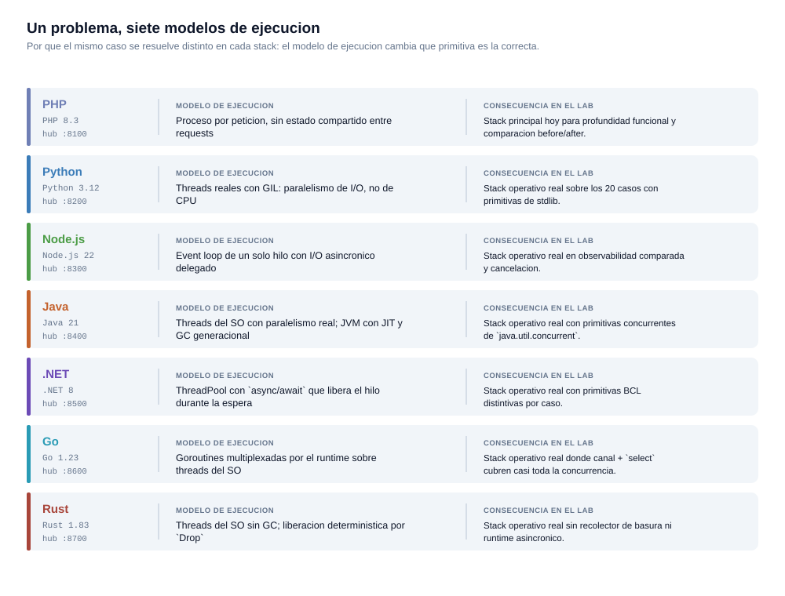
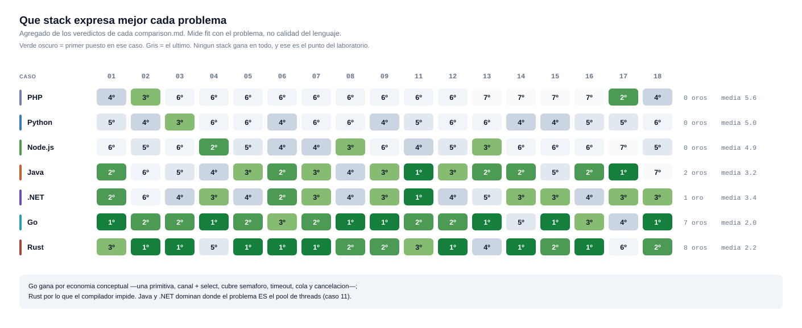

# 🛠️ Mapa de stacks

> Por qué hay múltiples lenguajes en el laboratorio y cómo se usan.

---

## 🎯 Objetivo de la multi-stack

El objetivo no es demostrar que todos los lenguajes son iguales.
El objetivo es mostrar cómo **el mismo problema se manifiesta y se resuelve de forma diferente** según el ecosistema.

---

## 📦 Stacks base incluidos

| Stack | Ícono | Versión | Fortaleza en el contexto del lab |
|-------|-------|---------|----------------------------------|
| PHP | 🐘 | 8.x | Ideal para casos de APIs web, ORMs y patrones MVC |
| Node.js | 🟢 | 20 LTS | Single-thread + event loop; primitivas estandar (`AbortController`, `AbortSignal.timeout`, `Proxy`, `EventEmitter`, `monitorEventLoopDelay`, `process.memoryUsage`) que mapean a problemas de cancelacion, contratos, eventos y observabilidad sin libreria externa |
| Python | 🐍 | 3.x | Data, análisis, scripting y rapidez de prototipado |
| Java | ☕ | 21 | Tipado fuerte, primitivas concurrentes ricas (`ConcurrentHashMap`, `CompletableFuture.orTimeout`, `LinkedHashMap` LRU, `Optional<T>`, `Semaphore`, `ThreadPoolExecutor`); paralelismo real sin GIL |
| .NET | 🔵 | 8 | Tipado fuerte con Nullable Reference Types, primitivas BCL idiomaticas (`ConcurrentDictionary`, `CancellationTokenSource`, `AsyncLocal<T>`, `Interlocked.CompareExchange`, `SemaphoreSlim`, `ImmutableList<T>`, `ThreadPool.GetAvailableWorkerThreads`); `record` types + `with`-expressions; `await` que no bloquea threads |
| Go | 🐹 | 1.23 | Concurrencia con una sola primitiva: canal + `select` cubren semaforo, timeout, cola y cancelacion. `context.Context` propaga deadlines que el callee **si** observa. Sin pool de threads que dimensionar: el runtime multiplexa goroutines. `log/slog` y `httputil.ReverseProxy` en la stdlib |
| Rust | 🦀 | 1.83 | Sin GC: liberacion deterministica via `Drop`, observable en el caso 05. Ausencia y exhaustividad en el sistema de tipos (`Option<T>`, `enum` + `match`). `Send + Sync` verificados por el compilador. Contrapartida: `std` no trae HTTP, JSON ni runtime asincronico |

---

> 🧬 **Cada stack tiene su perfil completo en [docs/languages/](languages/README.md)**: para qué sirve el lenguaje, primitivas que usa en los 19 casos, qué mide el laboratorio y cómo reproducirlo, límites documentados y qué revisar cuando publique una versión nueva.

---

## ⚙️ Modelos de ejecución comparados

El modelo de ejecución no es un dato de color: es lo que decide qué primitiva es la correcta. Un semáforo en Go es un canal; en Java es una clase `Semaphore`; en PHP es un archivo en disco. Los tres resuelven el caso 09, y las tres decisiones son correctas **en su modelo**.

---

## 🏆 Dónde encaja mejor cada stack

Este mapa de calor se deriva automáticamente de la sección *Veredicto* de los `comparison.md` — no se escribe a mano. Ninguna fila es toda verde: **cada lenguaje gana en unos casos y pierde en otros**, que es exactamente lo que hace que valga la pena compararlos.

> ⚠️ Es un ranking de **fit con el problema**, no de calidad de lenguaje.

---

## 🔍 Qué se estudia al comparar stacks

| Dimensión | Pregunta que responde |
|-----------|----------------------|
| 🏃 **Runtime** | ¿Cómo afecta el modelo de ejecución al problema? |
| 🧰 **Tooling** | ¿Qué herramientas existen para diagnosticar y resolver? |
| 📚 **Bibliotecas** | ¿Cómo el ecosistema facilita u obstaculiza la solución? |
| 💰 **Costos operativos** | ¿Cuánto pesa este stack en producción? |
| 🚀 **Estilo de despliegue** | ¿Cómo cambia la estrategia Docker por stack? |
| 👁️ **Observabilidad** | ¿Qué tan cómodo es instrumentar cada runtime? |
| 🤝 **Ergonomía del equipo** | ¿Es mantenible para un equipo estándar? |

---

## ⚖️ Regla de honestidad

> Este laboratorio **no afirma especialización histórica profunda** en todos los ecosistemas.
>
> Sí demuestra:
> - ✅ capacidad de análisis y comparación,
> - ✅ documentación técnica rigurosa,
> - ✅ adaptación a distintos toolings,
> - ✅ criterio para evaluar trade-offs entre lenguajes.
